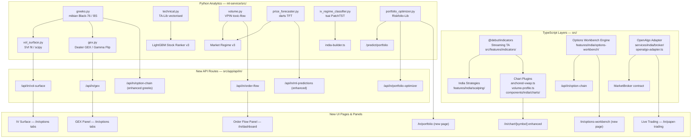
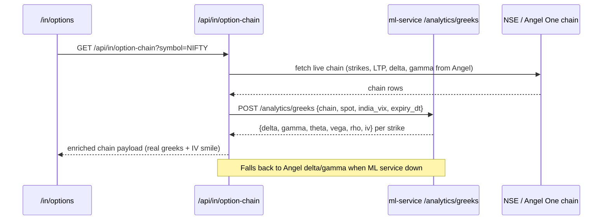
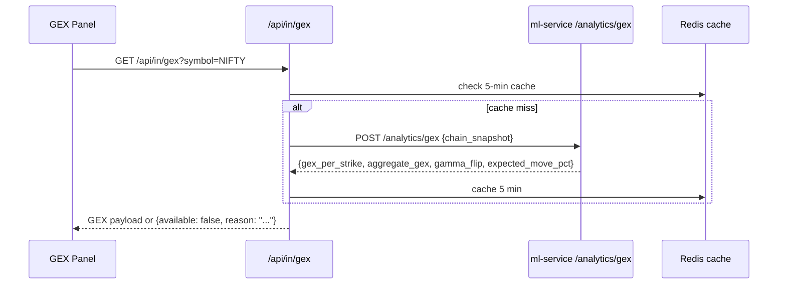
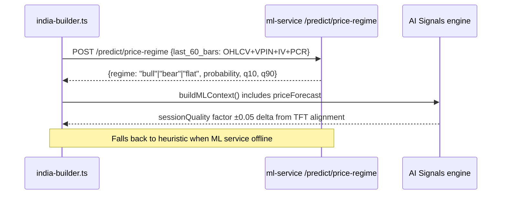

# Design Document: phase2-expert-quant

## Overview

This feature upgrades Alphaforge from "advanced retail" to "expert quant / prop desk" level for the Indian F&O market. It adds eight capability layers across the TypeScript frontend and Python ML service: a streaming indicator library (`@debut/indicators`), lightweight-charts v5 institutional chart plugins (Anchored VWAP, Volume Profile), real Black-Scholes / Black-76 greeks on the NSE option chain (via `mibian`), a Dealer GEX engine, a 3D IV surface, TA-Lib vectorised feature engineering, deep-learning forecasters (TFT via `darts`, PatchTST via `tsai`), a VPIN order-flow indicator, an upgraded portfolio optimizer (Riskfolio-Lib), an options strategy workbench (payoff diagrams, multi-leg builder), and an OpenAlgo-compatible broker adapter for live order execution. All enhancements are additive and degrade gracefully when optional services are absent.

---

## Architecture



---

## Sequence Diagrams

### Task 3 — Real Greeks Flow



### Task 4 — GEX Pipeline



### Task 8 — TFT Forecast Integration



---

## Components and Interfaces

### Component 1: `src/features/indicators/` — Streaming Indicator Adapter

**Purpose**: Wraps `@debut/indicators` streaming classes behind a stable interface used by all India strategies.

**Interface**:
```typescript
interface IndicatorOutput {
  ema: number[];
  sma: number[];
  rsi: number[];
  atr: number[];
  bollinger: { upper: number[]; mid: number[]; lower: number[] };
  supertrend: { value: number[]; direction: ('up' | 'down')[] };
  volumeProfile: { poc: number; vah: number; val: number };
}

function streamIndicators(bars: OHLCV[], config: IndicatorConfig): IndicatorOutput;
function dumpState(indicators: ActiveIndicators): SerializedState;
function restoreState(state: SerializedState): ActiveIndicators;
```

**Responsibilities**:
- Wrap `@debut/indicators` EMA, ATR(Wilder), RSI, BollingerBands, VolumeProfile, SuperTrend classes
- Expose `.nextValue()` streaming API per bar (zero recomputation)
- Calibrate `VolumeProfile` tick size to NSE conventions: 0.05 for stocks, 1 for NIFTY, 5 for BANKNIFTY
- Support `.dumpState()` / `.restoreState()` for Redis-serialised warm starts

---

### Component 2: `src/components/india/charts/` — Chart Plugins

**Purpose**: Lightweight-charts v5 plugins for Anchored VWAP and Volume Profile rendered directly on the existing price chart.

**Interface**:
```typescript
interface AnchoredVwapPlugin extends IChartSeriesPlugin {
  anchors: ('session' | 'daily' | 'weekly')[];
  setTheme(palette: ChartPalette): void;
}

interface VolumeProfilePlugin extends IChartSeriesPlugin {
  poc: number;
  vah: number;
  val: number;
}
```

**Responsibilities**:
- `anchored-vwap.ts`: accumulate `Σ(HLC3 × volume) / Σvolume` from the chosen anchor bar; render as three `LineSeries` overlays (session open 09:15 IST, daily open, weekly open)
- `volume-profile.ts`: render POC/VAH/VAL as horizontal lines + optional mini histogram using VolumeProfile output from the indicator layer
- Both plugins toggled via toolbar above the chart; palette follows `useTheme()`

---

### Component 3: `ml-service/src/greeks.py` — BS / Black-76 Greeks Engine

**Purpose**: Compute full option greeks and solve IV from market LTP for NSE option chains.

**Interface**:
```python
def compute_greeks_bs(spot, strike, r, t, sigma, flag) -> dict:
    # returns: {delta, gamma, theta, vega, rho, iv}

def solve_iv_newton(market_price, spot, strike, r, t, flag) -> float:
    # Newton-Raphson, fallback to scipy.optimize.brentq

def compute_chain_greeks(chain_rows, spot, india_vix, expiry_dt) -> list[dict]:
    # vectorised over all strikes in a chain snapshot
```

**Responsibilities**:
- Use `mibian` for Black-Scholes (stock options) and Black-76 (index options — European style)
- Risk-free rate: Indian 10Y G-Sec yield (~7.1%, configurable)
- Time to expiry: `trading_days_to_expiry / 252` (NSE calendar)
- Exposed at `POST /analytics/greeks` on the ML service

---

### Component 4: `ml-service/src/gex.py` — Dealer GEX Engine

**Purpose**: Compute NSE Dealer Gamma Exposure (GEX) per strike and aggregate, exposing gamma flip level and expected daily move band.

**Interface**:
```python
LOT_SIZES = {"NIFTY": 50, "BANKNIFTY": 15, "FINNIFTY": 40, "MIDCPNIFTY": 75}

def compute_gex(chain_snapshot, spot, lot_size) -> GexResult:
    # Per-strike GEX = gamma × OI × lot_size × spot²  (CE adds, PE subtracts)
    # Aggregate GEX = Σ per-strike GEX
    # Gamma flip = strike where cumulative GEX crosses zero
    # Expected move = spot × sqrt(|aggregate_GEX| / (spot² × total_OI × lot_size))
    # returns: {strikes, gex_per_strike, aggregate_gex, gamma_flip, expected_move_pct,
    #           positive_gex_wall, negative_gex_wall}
```

---

### Component 5: `ml-service/src/vol_surface.py` — IV Surface

**Purpose**: Build the full implied volatility surface across strikes and expiries using SVI parametrisation.

**Interface**:
```python
def build_iv_surface(snapshots_by_expiry: dict) -> dict:
    # keyed by expiry date, arrays of (strike, iv)

def fit_svi(strikes, ivs, forward) -> SVIParams:
    # scipy.optimize.minimize — arbitrage-free SVI surface
    # returns: {a, b, rho, m, sigma}

def compute_term_structure(atm_ivs_by_expiry) -> list[dict]:
    # returns: [{days_to_expiry, atm_iv}, ...]
```

---

### Component 6: `src/features/india/options-workbench/` — Options Strategy Workbench

**Purpose**: Pure TypeScript payoff engine for multi-leg NSE F&O strategies.

**Interface**:
```typescript
interface OptionLeg {
  strike: number;
  flag: 'CE' | 'PE';
  quantity: number;  // negative = short
  premium: number;
  expiry: string;
}

interface StrategyAnalysis {
  payoffAtExpiry: { spot: number; pnl: number }[];
  payoffToday: { spot: number; pnl: number }[];
  breakEvens: number[];
  netGreeks: { delta: number; gamma: number; theta: number; vega: number };
  maxProfit: number;
  maxLoss: number;
}

function computePayoff(legs: OptionLeg[], spotRange: number[], premiums: number[]): StrategyAnalysis;
function aggregateGreeks(legs: OptionLeg[], greeksPerLeg: Greeks[]): NetGreeks;
```

---

### Component 7: `src/services/india/broker/openalgo-adapter.ts` — OpenAlgo Broker Adapter

**Purpose**: Implements the `MarketBroker` contract using the normalised OpenAlgo REST API, enabling any OpenAlgo-compatible Indian broker.

**Interface**:
```typescript
class OpenAlgoAdapter implements MarketBroker {
  constructor(baseUrl: string, apiKey: string);
  getQuote(symbol: string): Promise<Quote>;
  getHistorical(symbol: string, interval: string, from: Date, to: Date): Promise<OHLCV[]>;
  placeOrder(params: OrderParams): Promise<OrderResult>;  // gated behind LIVE_TRADING_ENABLED
  modifyOrder(id: string, params: Partial<OrderParams>): Promise<OrderResult>;
  cancelOrder(id: string): Promise<void>;
}
```

---

## Data Models

### Model 1: `GexResult`

```typescript
interface GexResult {
  symbol: string;
  spot: number;
  strikes: number[];
  gexPerStrike: number[];         // positive = dealer long gamma (stabilising)
  aggregateGex: number;
  gammaFlip: number;              // strike where cumulative GEX crosses zero
  expectedMovePct: number;        // ± expected daily range
  positiveGexWall: number;        // strongest support strike
  negativeGexWall: number;        // strongest resistance strike
  computedAt: string;             // ISO timestamp
  available: boolean;
}
```

**Validation Rules**:
- `gammaFlip` must be within the strike range of the chain
- `expectedMovePct` must be positive
- `available: false` emitted when ML service is unreachable

---

### Model 2: `VolSurfaceResponse`

```typescript
interface VolSurfaceResponse {
  symbol: string;
  expiries: string[];             // ISO date strings
  ivByExpiry: Record<string, { strike: number; iv: number }[]>;
  termStructure: { daysToExpiry: number; atmIv: number }[];
  sviParams: Record<string, SVIParams>;
  available: boolean;
}
```

---

### Model 3: `PriceForecastResponse`

```typescript
interface PriceForecastResponse {
  symbol: string;
  regime: 'bull' | 'bear' | 'flat';
  probability: number;    // [0, 1]
  q10: number;            // 10th percentile expected move %
  q90: number;            // 90th percentile expected move %
  horizon: '1h';
  available: boolean;
}
```

---

### Model 4: `IvRegimeResponse`

```typescript
interface IvRegimeResponse {
  symbol: string;
  ivRegime: 'CRUSH' | 'STABLE' | 'SPIKE';
  confidence: number;   // [0, 1]
  available: boolean;
}
```

---

### Model 5: `VpinResponse`

```typescript
interface VpinResponse {
  symbol: string;
  vpin: number;         // [0, 1] — 0 benign, 1 toxic
  bucketHistory: number[];   // last 20 VPIN bucket values
  classification: 'toxic' | 'elevated' | 'benign';
  available: boolean;
}
```

---

### Model 6: `PortfolioAllocation`

```typescript
interface PortfolioAllocation {
  method: 'hrp' | 'cvar' | 'max_diversification' | 'factor';
  weights: Record<string, number>;   // symbol → weight, sum to 1
  riskMetrics: {
    volatility: number;
    cvar: number;            // at alpha=0.05
    sharpe: number;
    maxDrawdown: number;
  };
  efficientFrontier?: { risk: number; return: number }[];
  available: boolean;
}
```

---

## Algorithmic Pseudocode

### Task 1: Streaming Indicator Migration

```pascal
ALGORITHM streamIndicators(bars, config)
INPUT: bars — array of OHLCV bars; config — {periods, tickSize}
OUTPUT: IndicatorOutput

BEGIN
  // Restore state from Redis if available, else initialise fresh
  state ← restoreStateOrInit(config)
  
  FOR each bar IN bars DO
    // Feed bar to each streaming indicator (O(1) per bar, no full recompute)
    state.ema.nextValue(bar.close)
    state.atr.nextValue({high: bar.high, low: bar.low, close: bar.close})
    state.rsi.nextValue(bar.close)
    state.bollinger.nextValue(bar.close)
    state.supertrend.nextValue(bar)
    state.volumeProfile.nextValue({price: bar.close, volume: bar.volume, tickSize: config.tickSize})
  END FOR
  
  // Dump state for Redis persistence
  dumpState(state)
  
  RETURN {
    ema:          state.ema.getValues(),
    atr:          state.atr.getValues(),
    rsi:          state.rsi.getValues(),
    bollinger:    state.bollinger.getValues(),
    supertrend:   state.supertrend.getValues(),
    volumeProfile: {
      poc: state.volumeProfile.getPOC(),
      vah: state.volumeProfile.getVAH(),
      val: state.volumeProfile.getVAL()
    }
  }
END
```

**Preconditions**:
- `bars` is non-empty and sorted ascending by time
- `config.tickSize` is calibrated to the NSE instrument (0.05 / 1 / 5)

**Postconditions**:
- Each output array has length equal to `bars.length`
- Warm start after worker restart completes in ≤ 5 bars of computation
- ATR output matches Wilder's SMMA implementation to within 0.01%

---

### Task 3: Black-76 Greeks Computation

```pascal
ALGORITHM compute_chain_greeks(chain_rows, spot, india_vix, expiry_dt)
INPUT: chain_rows — list of {strike, ltp, ce_pe, open_interest}
       spot — current index level
       india_vix — current India VIX (annualised vol estimate)
       expiry_dt — expiry datetime
OUTPUT: list of enriched rows with {delta, gamma, theta, vega, rho, iv}

BEGIN
  r ← 0.071   // 10Y G-Sec yield
  t ← trading_days_until(expiry_dt) / 252
  F ← spot * exp(r * t)   // Forward price for Black-76
  
  FOR each row IN chain_rows DO
    sigma_init ← india_vix / 100   // initial IV guess from VIX
    
    // Solve IV from market LTP via Newton-Raphson
    IF row.ltp > 0 THEN
      iv ← solve_iv_newton(row.ltp, F, row.strike, r, t, row.ce_pe)
    ELSE
      iv ← sigma_init
    END IF
    
    // Compute full greeks using Black-76 (index) or Black-Scholes (stock)
    IF is_index_option(row.underlying) THEN
      greeks ← black76(F, row.strike, r, t, iv, row.ce_pe)
    ELSE
      greeks ← black_scholes(spot, row.strike, r, t, iv, row.ce_pe)
    END IF
    
    row.delta ← greeks.delta
    row.gamma ← greeks.gamma
    row.theta ← greeks.theta
    row.vega  ← greeks.vega
    row.iv    ← iv
  END FOR
  
  RETURN chain_rows
END
```

**Preconditions**:
- `expiry_dt` is in the future (t > 0)
- `india_vix` > 0

**Postconditions**:
- CE delta ∈ (0, 1); PE delta ∈ (−1, 0)
- ATM delta ≈ ±0.50 (within 0.05)
- All gamma values are positive
- All theta values are negative

---

### Task 4: GEX Computation

```pascal
ALGORITHM compute_gex(chain_snapshot, spot, lot_size)
INPUT: chain_snapshot — list of {strike, ce_gamma, pe_gamma, ce_oi, pe_oi}
       spot — current spot price
       lot_size — NSE contract lot size (e.g. 50 for NIFTY)
OUTPUT: GexResult

BEGIN
  gex_per_strike ← []
  
  FOR each row IN chain_snapshot DO
    // Dealers are short calls (negative CE exposure) and short puts (positive PE exposure)
    ce_gex ← row.ce_gamma × row.ce_oi × lot_size × spot²  × (-1)
    pe_gex ← row.pe_gamma × row.pe_oi × lot_size × spot²  × (+1)
    net_gex ← ce_gex + pe_gex
    gex_per_strike.append({strike: row.strike, gex: net_gex})
  END FOR
  
  aggregate_gex ← Σ net_gex FOR ALL strikes
  
  // Gamma flip: strike where cumulative sum crosses zero
  cumulative ← 0
  gamma_flip ← spot   // default to spot if no flip found
  FOR each item IN gex_per_strike SORTED by strike ASC DO
    cumulative ← cumulative + item.gex
    IF cumulative crosses zero THEN
      gamma_flip ← item.strike
    END IF
  END FOR
  
  // Expected daily move from aggregate GEX
  total_oi ← Σ (ce_oi + pe_oi) FOR ALL strikes
  IF total_oi > 0 THEN
    expected_move_pct ← sqrt(|aggregate_gex| / (spot² × total_oi × lot_size)) × 100
  ELSE
    expected_move_pct ← 0
  END IF
  
  RETURN {gex_per_strike, aggregate_gex, gamma_flip, expected_move_pct,
          positive_gex_wall: max_positive_strike(gex_per_strike),
          negative_gex_wall: min_negative_strike(gex_per_strike)}
END
```

**Preconditions**:
- `lot_size` is the canonical NSE lot for the symbol
- `chain_snapshot` contains non-null gamma values (or falls back to Task 3 greeks)

**Postconditions**:
- `expected_move_pct` is positive
- `gammaFlip` is within the range `[min_strike, max_strike]`

---

### Task 7: VPIN Computation

```pascal
ALGORITHM compute_vpin(bars, bucket_size, n_buckets)
INPUT: bars — 5-min OHLCV bars; bucket_size — volume units per bucket;
       n_buckets — lookback window (default 50)
OUTPUT: {vpin_series: float[], current_vpin: float}

BEGIN
  buckets ← []
  current_bucket_buy_vol ← 0
  current_bucket_sell_vol ← 0
  current_bucket_total   ← 0
  
  FOR i FROM 1 TO len(bars) DO
    bar ← bars[i]
    prev_close ← bars[i-1].close
    
    // Tick rule: classify bar volume as buy or sell
    IF bar.close > prev_close THEN
      buy_fraction ← 0.85
    ELSE IF bar.close < prev_close THEN
      buy_fraction ← 0.15
    ELSE
      buy_fraction ← 0.50
    END IF
    
    buy_vol  ← bar.volume × buy_fraction
    sell_vol ← bar.volume × (1 - buy_fraction)
    
    current_bucket_buy_vol  ← current_bucket_buy_vol + buy_vol
    current_bucket_sell_vol ← current_bucket_sell_vol + sell_vol
    current_bucket_total    ← current_bucket_total + bar.volume
    
    IF current_bucket_total >= bucket_size THEN
      bucket_vpin ← |current_bucket_buy_vol - current_bucket_sell_vol| / bucket_size
      buckets.append(bucket_vpin)
      current_bucket_buy_vol  ← 0
      current_bucket_sell_vol ← 0
      current_bucket_total    ← 0
    END IF
  END FOR
  
  recent_buckets ← last n_buckets OF buckets
  current_vpin ← mean(recent_buckets)
  
  RETURN {vpin_series: buckets, current_vpin: current_vpin}
END
```

**Preconditions**:
- `bars` contains at least `n_buckets` worth of volume data
- `bucket_size` > 0

**Postconditions** (Loop Invariant):
- All VPIN values ∈ [0, 1]
- All previous bucket values remain unchanged as new bars are processed

---

### Task 11: Payoff Diagram Computation

```pascal
ALGORITHM computePayoff(legs, spot_range, premiums_at_strike)
INPUT: legs — list of OptionLeg; spot_range — array of spot prices at expiry;
       premiums_at_strike — current option premiums per leg
OUTPUT: StrategyAnalysis

BEGIN
  payoff_expiry ← []
  payoff_today  ← []
  
  FOR each spot IN spot_range DO
    net_pnl_expiry ← 0
    net_pnl_today  ← 0
    
    FOR each leg IN legs DO
      // Payoff at expiry (intrinsic only)
      IF leg.flag = 'CE' THEN
        intrinsic ← max(0, spot - leg.strike)
      ELSE
        intrinsic ← max(0, leg.strike - spot)
      END IF
      
      net_pnl_expiry ← net_pnl_expiry + leg.quantity × (intrinsic - leg.premium)
      
      // Payoff today using BS price at current spot
      bs_price ← black_scholes_price(spot, leg.strike, r, t, leg.iv, leg.flag)
      net_pnl_today ← net_pnl_today + leg.quantity × (bs_price - leg.premium)
    END FOR
    
    payoff_expiry.append({spot, pnl: net_pnl_expiry})
    payoff_today.append({spot, pnl: net_pnl_today})
  END FOR
  
  break_evens ← spots WHERE payoff_expiry.pnl crosses zero
  
  RETURN {payoff_expiry, payoff_today, break_evens,
          maxProfit: max(payoff_expiry.map(p => p.pnl)),
          maxLoss: min(payoff_expiry.map(p => p.pnl)),
          netGreeks: aggregateGreeks(legs)}
END
```

**Preconditions**:
- All `legs` have valid `strike`, `premium`, `flag`, `quantity`
- `spot_range` covers the full expected move band (at least ±3σ from current spot)

**Postconditions**:
- `breakEvens` count matches theoretical (Long Call: 1, Straddle: 2, Iron Condor: 2)
- Long Call payoff at expiry = `max(0, spot − strike) − premium` for every spot
- Iron Condor payoff at centre = net credit received

---

## Key Functions with Formal Specifications

### `streamIndicators(bars, config) → IndicatorOutput`

**Preconditions**:
- `bars.length ≥ max(config.emaPeriod, config.rsiPeriod, config.atrPeriod, config.bollingerPeriod)`
- Each bar has valid OHLCV fields (non-negative numbers)

**Postconditions**:
- `output.atr` values match Wilder's SMMA to within 0.01% of existing `helpers.ts` output
- `output.volumeProfile.poc` is the price bucket with the highest total volume
- `output.supertrend.direction` alternates only on confirmed signal crossings

---

### `compute_gex(chain_snapshot, spot, lot_size) → GexResult`

**Preconditions**:
- `spot > 0`; `lot_size ∈ LOT_SIZES.values()`
- `chain_snapshot` has ≥ 10 valid strike rows

**Postconditions**:
- `Σ gex_per_strike ≡ aggregate_gex`
- `expected_move_pct > 0`
- GEX sign convention: CE exposure negative (dealers short calls), PE exposure positive (dealers short puts)

---

### `computePayoff(legs, spotRange, premiums) → StrategyAnalysis`

**Preconditions**:
- `legs.length ≥ 1`
- All `leg.premium ≥ 0`; all `leg.quantity ≠ 0`

**Postconditions**:
- Long Call at expiry: `pnl = max(0, spot − strike) − premium` for all spots
- Straddle max loss at ATM: `−(call_premium + put_premium)`
- Net delta of a delta-neutral strategy ≈ 0 (within 0.05)

---

## NSE-Specific Calibration

| Parameter | NIFTY | BANKNIFTY | FINNIFTY | MIDCPNIFTY | Stocks |
|---|---|---|---|---|---|
| Lot size | 50 | 15 | 40 | 75 | varies |
| Tick size | 1 pt | 5 pt | 1 pt | 1 pt | 0.05 |
| Options style | European | European | European | European | American |
| Pricing model | Black-76 | Black-76 | Black-76 | Black-76 | Black-Scholes |
| Expiry cycle | Weekly (Tue) + Monthly | Weekly (Wed) + Monthly | Weekly (Tue) + Monthly | Monthly | Monthly |
| Risk-free rate | 10Y G-Sec ~7.1% | same | same | same | same |
| Volume Profile tickSize | 1 | 5 | 1 | 1 | 0.05 |

---

## Graceful Degradation Contract

Every new endpoint and panel follows this contract when optional services are unavailable:

```typescript
// API route — ML service down
{ available: false, reason: "ML service unreachable" }

// API route — data not yet computed / model untrained
{ available: false, reason: "Model not trained" }

// UI component pattern
if (!data?.available) return <UnavailableBadge reason={data?.reason} />
```

No existing route, store, or worker job may throw because a Phase 2 service is absent.

---

## Dependency Additions

### npm (TypeScript/Node)
```
@debut/indicators   # streaming indicator library (GPL-3, npm) — exact version to be pinned at install
```

### pip (Python ML service)
```
mibian==0.1.3           # Black-Scholes/Black-76 greeks (pure Python)
darts==0.32.*           # TFT, N-BEATS probabilistic forecasting
tsai==1.0.*             # PatchTST IV regime classifier
TA-Lib==0.6.*           # vectorised C indicator library
Riskfolio-Lib==6.*      # HRP + CVaR portfolio optimizer
```

---

## Error Handling

### Scenario 1: ML Service Down

**Condition**: Python ML service on port 8100 is unreachable (network error, Docker not running)
**Response**: All new `GET /api/in/*` routes that depend on the ML service return `{ available: false, reason: "ML service unreachable" }` with HTTP 200 (not 503) so the UI renders a graceful empty state
**Recovery**: When service restarts, next request automatically succeeds (no cache poisoning)

### Scenario 2: TA-Lib C Library Not Installed

**Condition**: Docker Dockerfile apt-get fails to install `ta-lib` system library
**Response**: Python service fails to start; existing heuristic fallbacks in `technical.py` are preserved; the `technical.py` migration is guarded by a `try/import talib` block
**Recovery**: Fix Dockerfile and rebuild image

### Scenario 3: `@debut/indicators` Version Conflict

**Condition**: Breaking change in a new version of the package
**Response**: Pinned exact version in `package.json`; `streamIndicators` adapter isolates the dependency so strategy code has no direct `@debut/indicators` imports
**Recovery**: Update adapter layer only, no strategy code changes required

### Scenario 4: IV Solver Non-Convergence

**Condition**: Newton-Raphson solver fails to converge for deep OTM options
**Response**: Fall back to `scipy.optimize.brentq` bracket solver; if that also fails, return `iv: null` for that strike (chain still renders without crashing)
**Recovery**: Per-strike — other strikes unaffected

### Scenario 5: Live Order Placement Without Flag

**Condition**: `placeOrder()` called when `LIVE_TRADING_ENABLED` env var is not set
**Response**: Throw `Error("Live trading is not enabled. Set LIVE_TRADING_ENABLED=true to allow order placement.")`
**Recovery**: User must explicitly opt in

---

## Testing Strategy

### Unit Testing Approach

- **Indicator migration**: Every migrated indicator (`ema`, `atr`, `rsi`, `bollinger`) is tested against known OHLCV fixtures. ATR must match existing `helpers.ts` Wilder's ATR to within 0.01%.
- **Greeks engine**: `compute_greeks_bs` tested against known ATM NIFTY values (delta ≈ 0.50 ± 0.05, gamma > 0, theta < 0, vega > 0).
- **GEX engine**: Given synthetic chain data, verify aggregate GEX sign, gamma flip within strike range, expected move is positive.
- **Payoff engine**: Long Call, Straddle, Iron Condor payoffs verified against closed-form formulas.
- **VPIN**: All-buy input → VPIN = 0; all-sell input → VPIN = 0; split 50/50 buckets → VPIN ≈ 0; all buys in one half → VPIN ≈ 1.
- **Portfolio optimizer**: Weights sum to 1.0, all weights ≥ 0.

### Property-Based Testing Approach

**Property Test Library**: `fast-check` (TypeScript), `hypothesis` (Python)

See the Correctness Properties section below.

### Integration Testing Approach

- **API route degradation**: Each new API route (`/api/in/gex`, `/api/in/vol-surface`, `/api/in/order-flow`) returns `{ available: false }` when the ML service mock returns a network error.
- **Option chain enrichment**: `/api/in/option-chain` returns complete chain when ML service is down (falls back to Angel One greeks).
- **End-to-end**: TFT forecast badge appears on `/in/ai-signals` when ML service is running.

---

## Performance Considerations

- TA-Lib vectorised C calls reduce batch scoring time for 200+ stocks from ~4 seconds to < 300 ms (Task 6).
- `@debut/indicators` streaming `.nextValue()` is O(1) per bar vs O(n) for full recompute — critical for worker hot path.
- GEX and vol-surface are cached in Redis for 5 minutes; VPIN for 2 minutes.
- TFT model inference is batched — 60 bars × multivariate input runs in < 500 ms on CPU.
- IV surface SVI fit uses `scipy.optimize.minimize` on the order of 50 strikes — < 100 ms per expiry.

---

## Security Considerations

- OpenAlgo API key stored encrypted at rest using the existing AES-256-GCM path (`src/lib/crypto.ts`).
- Live order placement (`placeOrder`) is gated behind `LIVE_TRADING_ENABLED=true` env var — not set by default.
- All new `/api/in/*` routes are protected routes (require Auth.js session via `src/proxy.ts`).
- No new secrets introduced beyond `OPENALGO_BASE_URL` and `OPENALGO_API_KEY` (same pattern as existing broker keys).
- Order confirmation modal in UI provides a second human confirmation before any real order is placed.

---

## Correctness Properties

*A property is a characteristic or behavior that should hold true across all valid executions of a system — essentially, a formal statement about what the system should do. Properties serve as the bridge between human-readable specifications and machine-verifiable correctness guarantees.*

### Property 1: Indicator warm-start round-trip

*For any* sequence of OHLCV bars, serialising the indicator state with `dumpState()` and restoring it with `restoreState()` must produce identical output to a continuous run from bar 0, for all subsequent bars fed after restoration.

**Validates: Requirements 1.4, 1.5**

---

### Property 2: ATR compatibility

*For any* OHLCV series of at least 30 bars, the ATR values produced by `streamIndicators` (using `@debut/indicators` Wilder's SMMA) must be within 0.01% of the values produced by the existing `helpers.ts` ATR implementation.

**Validates: Requirements 1.1**

---

### Property 3: Volume Profile POC invariant

*For any* session's OHLCV bars, the POC (Point of Control) returned by `VolumeProfile` must be the price row that received the highest cumulative volume across all bars in the session.

**Validates: Requirements 1.2, 2.2**

---

### Property 4: Anchored VWAP correctness

*For any* sequence of bars from a session open, the Anchored VWAP value must equal `Σ(HLC3 × volume) / Σvolume` computed from the anchor bar to the current bar.

**Validates: Requirements 2.1**

---

### Property 5: Greeks sign invariants

*For any* valid option (positive time-to-expiry, positive spot, positive strike):
- Call delta ∈ (0, 1) and put delta ∈ (−1, 0)
- All gamma values are positive (for both calls and puts)
- All theta values are negative (time decay always erodes value)
- Vega is positive (higher vol → higher option price)

**Validates: Requirements 3.1, 3.2**

---

### Property 6: GEX aggregate consistency

*For any* option chain snapshot, the aggregate GEX must equal the sum of all per-strike GEX values (exact arithmetic identity, modulo floating-point rounding to within 1e-6).

**Validates: Requirements 4.1**

---

### Property 7: VPIN bounds invariant

*For any* sequence of 5-min OHLCV bars and any positive bucket size, all VPIN values in the output series must lie in the closed interval [0, 1].

**Validates: Requirements 7.1, 7.2**

---

### Property 8: VPIN extreme cases

*For any* bucket where all classified volume is buy (or all sell), the bucket VPIN value must equal 1.0. For any bucket where buy and sell volume are exactly equal, the bucket VPIN must equal 0.0.

**Validates: Requirements 7.3, 7.4**

---

### Property 9: Payoff at expiry correctness

*For any* Long Call leg with premium `p`, strike `K`, and underlying spot `S` at expiry:
`payoff = max(0, S − K) − p` (exact, no tolerance).

*For any* Straddle (long call + long put, same strike, same premium per leg), max loss equals `−(call_premium + put_premium)`, achieved at the short strike.

*For any* Iron Condor, the payoff at the centre spot (between the two short strikes) equals the net credit received (sum of all leg premiums, signs respected).

**Validates: Requirements 11.1, 11.2, 11.3**

---

### Property 10: Portfolio weights sum-to-one

*For any* valid set of input return series and any supported optimisation method (HRP, CVaR, max diversification, factor), the returned allocation weights must sum to exactly 1.0 (within 1e-6) and all individual weights must be non-negative.

**Validates: Requirements 10.1, 10.2**

---

### Property 11: Live trading guard

*For any* call to `openAlgoAdapter.placeOrder()` when the environment variable `LIVE_TRADING_ENABLED` is not set to `"true"`, the function must throw an error and must not make any outbound HTTP request to the broker endpoint.

**Validates: Requirements 12.3, 12.8**

---

### Property 12: IV surface no-calendar-arbitrage

*For any* two expiries `T1 < T2` with the same forward price, the SVI-fitted ATM IV for `T2` must be greater than or equal to the SVI-fitted ATM IV for `T1` (variance must be non-decreasing in time — calendar-spread arbitrage free).

**Validates: Requirements 5.1**

---

### Property 13: Graceful degradation universality

*For any* new Phase 2 API route (`/api/in/gex`, `/api/in/vol-surface`, `/api/in/order-flow`, `/api/in/portfolio-optimizer`), when the ML service is unreachable, the route must return HTTP 200 with `{ available: false }` — it must never return a 5xx error or throw an unhandled exception.

**Validates: Requirements 3.5, 4.6, 5.4, 7.6, 13.1**

---

### Property 14: TA-Lib EMA equivalence

*For any* price series of at least 50 bars, the EMA(20) values produced by `talib.EMA()` must match the existing `technical.py` EMA implementation to within 1e-6 for every bar in the output series.

**Validates: Requirements 6.1, 6.6**

---

### Property 15: OpenAlgo response normalisation

*For any* valid HTTP response from an OpenAlgo-compatible broker endpoint, the `OpenAlgo_Adapter` must return a response that conforms to the `MarketBroker` contract type (all required fields present, all types correct).

**Validates: Requirements 12.1, 12.2**
