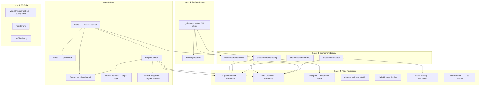
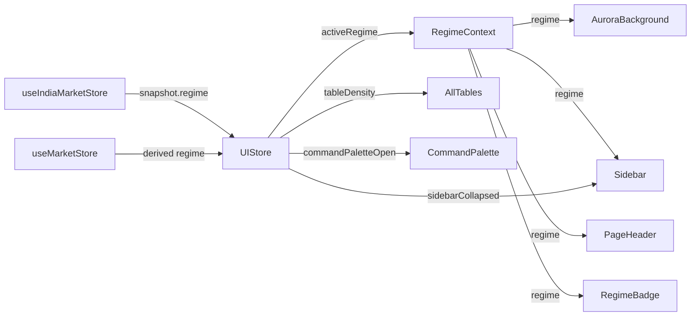

# Design Document: Trading UI Overhaul — Institutional Intelligence Terminal (IIT)

## Overview

This document covers the full technical design for the Institutional Intelligence Terminal (IIT) UI overhaul. The overhaul refactors every page and shell component of AlphaForge into a unified, precision-first design system. The work is **purely frontend** — no new API routes, no data-layer changes — and builds directly on top of the existing OKLCH token system in `globals.css`, the Zustand v5 store pattern, and the Framer Motion + React Three Fiber stack already installed.

The design language is named **IIT**: Bloomberg-meets-Figma, data-dense, institutionally credible. The core aesthetic principle is *information over decoration*: every color, animation, and spacing choice encodes meaning, not just style.

---

## Architecture

The overhaul is organized as five parallel layers that can be built and shipped incrementally:



### Shell Data Flow



---

## Components and Interfaces

### Layer 1: Design System

#### `globals.css` — New Token Extensions

The following tokens are **added** to the existing `@theme inline` block and `:root` / `.dark` variable blocks. No existing token is removed or renamed.

```css
/* @theme inline additions */
--color-panel-bg:     var(--panel-bg);
--color-panel-border: var(--panel-border);
--color-data-positive: var(--data-positive);
--color-data-negative: var(--data-negative);
--color-data-neutral:  var(--data-neutral);
--color-ai-accent:     var(--ai-accent);
--color-regime-bull:     var(--regime-bull);
--color-regime-bear:     var(--regime-bear);
--color-regime-sideways: var(--regime-sideways);
--color-regime-highvol:  var(--regime-highvol);
--radius-panel: 0.75rem;

/* spacing scale */
--space-1: 0.25rem;  --space-2: 0.5rem;   --space-3: 0.75rem;
--space-4: 1rem;     --space-5: 1.25rem;  --space-6: 1.5rem;
--space-7: 1.75rem;  --space-8: 2rem;     --space-9: 2.25rem;
--space-10: 2.5rem;  --space-11: 2.75rem; --space-12: 3rem;

/* font roles */
--font-data:  var(--font-geist-mono), ui-monospace, SFMono-Regular, monospace;
--font-label: var(--font-geist-sans), ui-sans-serif, system-ui, sans-serif;
--font-body:  var(--font-geist-sans), ui-sans-serif, system-ui, sans-serif;
```

Light mode values (`:root`):
```css
--panel-bg:     oklch(0.970 0.001 240);
--panel-border: oklch(0.91  0.003 240);
--data-positive: oklch(0.55 0.18 152);
--data-negative: oklch(0.56 0.23 25);
--data-neutral:  oklch(0.55 0.02 250);
--ai-accent:    oklch(0.62 0.22 195);
--regime-bull:     oklch(0.92 0.06 148 / 60%);
--regime-bear:     oklch(0.94 0.06 22  / 60%);
--regime-sideways: oklch(0.93 0.03 240 / 50%);
--regime-highvol:  oklch(0.93 0.07 75  / 55%);
```

Dark mode values (`.dark`):
```css
--panel-bg:     oklch(0.155 0.013 260);
--panel-border: oklch(0.225 0.015 260);
--data-positive: oklch(0.76 0.20 155);
--data-negative: oklch(0.68 0.24 22);
--data-neutral:  oklch(0.62 0.04 250);
--ai-accent:    oklch(0.78 0.22 195);
--regime-bull:     oklch(0.40 0.12 150 / 30%);
--regime-bear:     oklch(0.38 0.12 22  / 30%);
--regime-sideways: oklch(0.35 0.05 240 / 22%);
--regime-highvol:  oklch(0.42 0.12 75  / 28%);
```

New `@keyframes` additions:
```css
@keyframes price-flash-up {
  0%   { background-color: color-mix(in oklch, var(--data-positive) 28%, transparent); }
  100% { background-color: transparent; }
}
@keyframes price-flash-down {
  0%   { background-color: color-mix(in oklch, var(--data-negative) 28%, transparent); }
  100% { background-color: transparent; }
}
@keyframes breakout-pulse {
  0%   { transform: scale(0.8); opacity: 0.8; }
  60%  { transform: scale(2.4); opacity: 0.3; }
  100% { transform: scale(3.0); opacity: 0; }
}
@keyframes vix-warning-pulse {
  0%, 100% { box-shadow: 0 0 0 1px color-mix(in oklch, var(--data-negative) 35%, transparent); }
  50%       { box-shadow: 0 0 0 3px color-mix(in oklch, var(--data-negative) 18%, transparent); }
}
@keyframes celebration-pulse {
  0%   { box-shadow: 0 0 0 0 color-mix(in oklch, var(--data-positive) 50%, transparent); }
  70%  { box-shadow: 0 0 0 12px transparent; }
  100% { box-shadow: 0 0 0 0 transparent; }
}
@keyframes shimmer-border {
  0%   { background-position: -200% 0; }
  100% { background-position: 200% 0; }
}
```

New utility classes:
```css
/* data-density pattern */
[data-density="compact"]     { --row-h: 32px; }
[data-density="default"]     { --row-h: 40px; }
[data-density="comfortable"] { --row-h: 48px; }

/* Regime-reactive aurora CSS variables — overridden by JS/context */
:root {
  --aurora-regime-a: oklch(0.50 0.18 200 / 18%);
}
.dark {
  --aurora-regime-a: oklch(0.50 0.18 200 / 18%);
  transition: --aurora-regime-a 1200ms ease; /* CSS custom property transition */
}
```

#### `src/lib/motion-presets.ts`

```typescript
import type { MotionProps, Transition } from "framer-motion";

export const SPRING_FAST: Transition = {
  type: "spring",
  stiffness: 600,
  damping: 35,
};

export const SPRING_DEFAULT: Transition = {
  type: "spring",
  stiffness: 400,
  damping: 28,
};

export const SPRING_GENTLE: Transition = {
  type: "spring",
  stiffness: 240,
  damping: 24,
};

export const SPRING_MICRO: Transition = {
  type: "spring",
  stiffness: 800,
  damping: 40,
};

/**
 * Returns Framer Motion transition props for staggered list animations.
 * @param count    - Number of children to stagger.
 * @param baseDelay - Delay between each child in seconds. Default 0.04s (40ms).
 */
export function stagger(
  count: number,
  baseDelay = 0.04,
): Pick<MotionProps, "transition"> {
  return {
    transition: {
      staggerChildren: baseDelay,
      delayChildren: 0,
    },
  };
}
```

---

### Layer 2: Shell Architecture

#### `src/store/uiStore.ts`

Follows the same `create<T>()` pattern as `src/store/marketStore.ts` and `src/store/india/marketStore.ts`.

```typescript
"use client";

import { create } from "zustand";
import { persist } from "zustand/middleware";
import type { MarketRegime } from "@/components/3d/market-intelligence-core";

interface UIState {
  // --- Persisted ---
  sidebarCollapsed: boolean;
  tableDensity: "compact" | "default" | "comfortable";

  // --- Session-only ---
  commandPaletteOpen: boolean;
  activeRegime: MarketRegime;
  chartFullscreen: boolean;
  radarVisible: boolean;

  // --- Actions ---
  toggleSidebar: () => void;
  setSidebarCollapsed: (v: boolean) => void;
  openCommandPalette: () => void;
  closeCommandPalette: () => void;
  setRegime: (regime: MarketRegime) => void;
  setDensity: (density: UIState["tableDensity"]) => void;
  setChartFullscreen: (v: boolean) => void;
  toggleRadar: () => void;
}

export const useUIStore = create<UIState>()(
  persist(
    (set) => ({
      sidebarCollapsed: false,
      tableDensity: "compact",
      commandPaletteOpen: false,
      activeRegime: "UNKNOWN",
      chartFullscreen: false,
      radarVisible: false,

      toggleSidebar: () =>
        set((s) => ({ sidebarCollapsed: !s.sidebarCollapsed })),
      setSidebarCollapsed: (v) => set({ sidebarCollapsed: v }),
      openCommandPalette: () => set({ commandPaletteOpen: true }),
      closeCommandPalette: () => set({ commandPaletteOpen: false }),
      setRegime: (activeRegime) => set({ activeRegime }),
      setDensity: (tableDensity) => set({ tableDensity }),
      setChartFullscreen: (chartFullscreen) => set({ chartFullscreen }),
      toggleRadar: () => set((s) => ({ radarVisible: !s.radarVisible })),
    }),
    {
      name: "af-ui",
      // Only persist sidebar and density — regime/chart/radar are session state
      partialize: (s) => ({
        sidebarCollapsed: s.sidebarCollapsed,
        tableDensity: s.tableDensity,
      }),
    },
  ),
);
```

Note: The `persist` middleware stores `sidebarCollapsed` under key `af-ui` (as a sub-object). If requirements dictate separate keys (`af-ui-sidebar-collapsed`, `af-ui-table-density`), two separate persisted slices or a custom storage adapter can be used. The design prefers a single store key for atomic writes.

#### `src/lib/regime-context.tsx`

```typescript
"use client";

import * as React from "react";
import type { MarketRegime } from "@/components/3d/market-intelligence-core";
import { useUIStore } from "@/store/uiStore";

interface RegimeContextValue {
  regime: MarketRegime;
  isHighVol: boolean;
  vix: number | null;
}

export const RegimeContext = React.createContext<RegimeContextValue>({
  regime: "UNKNOWN",
  isHighVol: false,
  vix: null,
});

export function useRegime(): RegimeContextValue {
  return React.useContext(RegimeContext);
}

interface RegimeProviderProps {
  children: React.ReactNode;
  /** Raw India VIX value — read from snapshot in the India layout. */
  vix?: number | null;
}

export function RegimeProvider({ children, vix = null }: RegimeProviderProps) {
  const regime = useUIStore((s) => s.activeRegime);
  const isHighVol = vix != null && vix > 25;

  // Aurora CSS variable update — handled via inline style on the root div
  // so it uses CSS transitions (1200ms ease) without a JS frame loop.
  const auroraColor =
    regime === "BULL"     ? "oklch(0.50 0.18 155 / 18%)" :
    regime === "BEAR"     ? "oklch(0.42 0.18 22  / 18%)" :
    regime === "SIDEWAYS" ? "oklch(0.50 0.18 200 / 18%)" :
                            "oklch(0.50 0.18 200 / 18%)";

  return (
    <RegimeContext.Provider value={{ regime, isHighVol, vix }}>
      {/* CSS variable injection for aurora color transition */}
      <div
        style={
          {
            "--aurora-regime-a": auroraColor,
            transition: "--aurora-regime-a 1200ms ease",
            display: "contents",
          } as React.CSSProperties
        }
      >
        {children}
      </div>
    </RegimeContext.Provider>
  );
}
```

#### `src/components/dashboard/sidebar.tsx` — Refactoring Additions

The existing sidebar file already implements the `layoutId="sidebar-active-bar"` pill, collapsible rail, and `AnimatePresence`. The IIT refactor adds:

1. **Width change**: `collapsed ? 56 : 248` (currently 64 / 240).
2. **Regime strip**: 2px right-edge strip colored from `--color-regime-*` — only rendered when `market === "india"`.
3. **Footer replacement**: `FooterDataStrip` replaces `FooterCard` — shows data source, refresh timestamp, and connection quality dot.
4. **Sign-in shimmer**: animated gradient border on the `SignInNudge` using `shimmer-border` keyframe.
5. **Nav group separator**: two `INDIA_NAV` groups split with `separator-gradient` — primary (items 0–9) and tools (items 10+).
6. **Keyboard nav**: `onKeyDown` handler on the `<nav>` element — ArrowUp/ArrowDown cycles items, Enter navigates, Escape blurs.

Key interface additions:
```typescript
interface SidebarProps {
  isAuthed: boolean;
  indiaSourceLabels?: string[];
  // New: regime for the indicator strip
  regime?: "BULL" | "BEAR" | "SIDEWAYS" | "UNKNOWN";
  connectionQuality?: "good" | "degraded" | "offline";
  lastRefreshed?: Date | null;
}
```

Animation: `animate={{ width: collapsed ? 56 : 248 }}` with `SPRING_DEFAULT` transition.

#### `src/components/dashboard/topbar.tsx` — Refactoring Additions

Current height is `h-13` (52px via Tailwind). The refactor:

1. **Breadcrumb**: `TopbarBreadcrumb` component reads `usePathname()` and derives `Market · Section` labels.
2. **ConnectionPill**: Three-state, `SPRING_MICRO` transitions. Already exists — refactor adds the state machine.
3. **ThemeToggle**: Refactored from icon-only to three-segment pill with `layoutId="theme-pill"` and `SPRING_FAST`.
4. **CommandPalette trigger**: `⌘K` chip with 8s interval pulse animation + `prefers-reduced-motion` guard.
5. **VIX chip**: conditional Risk Warning, driven by `useRegime().isHighVol`.

```typescript
interface TopbarProps {
  user: TopbarUser | null;
}

// New sub-components:
function TopbarBreadcrumb(): JSX.Element;       // derives from usePathname()
function VixWarningChip(): JSX.Element | null;  // shows when isHighVol
```

#### `src/components/dashboard/market-ticker-bar.tsx` — Refactoring

Additions to the crypto `TickerChip`:
- Price wraps `<NumberMorph>` — triggers on ticker price change.
- Flash: on price change, add class `animate-price-flash-up` or `animate-price-flash-down` (400ms, `animation-fill-mode: forwards`).
- Hover: already paused via `.ticker-scroll:hover { animation-play-state: paused }`.
- Mobile (`< 640px`): renders a 2-chip static strip instead of the scrolling ticker.

India ticker: add SENSEX chip alongside existing NIFTY/BANKNIFTY/FINNIFTY/VIX. Market-closed pill reads from India Best-Time engine.

---

### Layer 3: Trading Component Library

All components live in `src/components/trading/` and use only `var(--color-*)` CSS tokens. No Tailwind utilities referencing non-token colors.

#### `SignalBadge.tsx`

```typescript
export interface SignalBadgeProps {
  action: "LONG" | "SHORT" | "BUY" | "SELL" | "WAIT";
  size?: "sm" | "md" | "lg";
  showIcon?: boolean;
  className?: string;
}

export function SignalBadge({ action, size = "md", showIcon = true, className }: SignalBadgeProps): JSX.Element;
```

Color mapping: LONG/BUY → `--color-data-positive`, SHORT/SELL → `--color-data-negative`, WAIT → `--color-fg-muted`.

#### `ConfidenceBar.tsx`

```typescript
export interface ConfidenceBarProps {
  value: number;        // 0–100
  showLabel?: boolean;
  height?: number;      // px, default 6
  className?: string;
}

export function ConfidenceBar({ value, showLabel = false, height = 6, className }: ConfidenceBarProps): JSX.Element;
```

Fill gradient: `oklch` linear interpolation from `--color-data-neutral` at 0% to `--color-data-positive` at 100%. The gradient uses `color-mix(in oklch, var(--data-positive) ${value}%, var(--data-neutral))`.

#### `RegimeBadge.tsx`

```typescript
export type RegimeLabel = "BULL" | "BEAR" | "SIDEWAYS" | "HIGH_VOL" | "UNKNOWN";

export interface RegimeBadgeProps {
  regime: RegimeLabel;
  animate?: boolean;    // default true — triggers SPRING_MICRO on mount
  className?: string;
}

export function RegimeBadge({ regime, animate = true, className }: RegimeBadgeProps): JSX.Element;
```

Background tokens: `--color-regime-bull`, `--color-regime-bear`, `--color-regime-sideways`, `--color-regime-highvol`. Icons: TrendingUp (BULL), TrendingDown (BEAR), Minus (SIDEWAYS), AlertTriangle (HIGH_VOL).

#### `NumberMorph.tsx`

```typescript
export interface NumberMorphProps {
  value: number;
  prefix?: string;
  suffix?: string;
  decimals?: number;
  className?: string;
  /** Duration override — if omitted, computed from change magnitude. */
  duration?: number;
}

export function NumberMorph({ value, prefix, suffix, decimals = 2, className, duration }: NumberMorphProps): JSX.Element;
```

Implementation uses Framer Motion's `useMotionValue` + `useTransform` + `animate()`. Duration logic:
```typescript
function durationFor(prev: number, next: number): number {
  if (prev === 0) return 240;
  const change = Math.abs((next - prev) / prev);
  if (change < 0.01) return 120;
  if (change < 0.10) return 240;
  return 360;
}
```

#### `StatGrid.tsx`

```typescript
export interface StatItem {
  label: string;
  value: string | number;
  positive?: boolean;
  className?: string;
}

export interface StatGridProps {
  items: StatItem[];
  cols: 2 | 3 | 4;
  className?: string;
}

export function StatGrid({ items, cols, className }: StatGridProps): JSX.Element;
```

Uses CSS grid `grid-cols-{cols}`. Label uses `font-label` class (small, uppercase, tracked). Value uses `font-data` class (tabular-nums, monospace).

#### `PanelHeader.tsx`

```typescript
export interface PanelHeaderProps {
  title: string;
  icon?: React.ReactNode;
  badge?: React.ReactNode;
  action?: React.ReactNode;
  className?: string;
}

export function PanelHeader({ title, icon, badge, action, className }: PanelHeaderProps): JSX.Element;
```

Fixed 40px row height. Flex row: icon + title (left) + badge + action (right). Title: `text-sm font-semibold`.

#### `RiskMeter.tsx`

```typescript
export interface RiskMeterProps {
  value: number;       // 0–100
  orientation?: "horizontal" | "vertical";
  showLabel?: boolean;
  className?: string;
}

export function RiskMeter({ value, orientation = "horizontal", showLabel = true, className }: RiskMeterProps): JSX.Element;
```

Segmented bar: green (0–33), yellow (33–66), red (66–100). Each segment shows filled/unfilled based on `value`. The filled portion uses the segment's regime color.

#### `AiRadar.tsx`

The primary AI Radar table component. Full TanStack Table v9 implementation.

```typescript
export interface AiRadarRow {
  rank: number;
  symbol: string;
  sector: string;
  aiScore: number;           // 0–100
  momentum5d: number[];      // sparkline data points
  relativeVolume: number;    // e.g. 1.4 = 140% of avg
  oiDelta: number;           // positive = build-up, negative = unwind
  regime: RegimeLabel;
  signal: AiAction;
  entry?: number;
  stop?: number;
  tp1?: number;
  winProbability?: number;
  confluences?: AiSignal["confluences"];
}

export interface AiRadarProps {
  rows: AiRadarRow[];
  loading?: boolean;
  className?: string;
}

export function AiRadar({ rows, loading, className }: AiRadarProps): JSX.Element;
```

**Column definitions** (TanStack Table v9 `ColumnDef<AiRadarRow>[]`):

| id | header | accessor | cell | sortable |
|---|---|---|---|---|
| `rank` | `#` | `row.rank` | Number, right-aligned | no |
| `stock` | `Stock` | `row.symbol` | Symbol + `RegimeBadge` (sector) | yes |
| `aiScore` | `AI Score` | `row.aiScore` | `ConfidenceBar` + numeric | yes |
| `momentum` | `5D Momentum` | `row.momentum5d` | Mini SVG sparkline (10 points) | no |
| `volume` | `Volume` | `row.relativeVolume` | Relative volume bar (1× reference line) | yes |
| `oi` | `OI Build-up` | `row.oiDelta` | Arrow icon (↑/↓/→) + percentage | yes |
| `regime` | `Regime` | `row.regime` | `RegimeBadge` | yes |
| `signal` | `Signal` | `row.signal` | `SignalBadge` | yes |

**Hover Detail Panel**: An absolutely positioned card (right edge of the row, 280px wide). Appears after 200ms hover delay via `useTimeout`. Contains: `ConfidenceBar` rows for each confluence factor, win probability, entry/stop/TP1 grid, and a "View Signal" button.

```typescript
interface HoverDetailPanelProps {
  row: AiRadarRow;
  onViewSignal: (symbol: string) => void;
}
```

**Keyboard navigation**: `useRef` on each row with `tabIndex={0}`, `onKeyDown` handler for Enter (opens hover panel inline) and Escape (collapses).

---

### Layer 4: Page Layout Primitives

All in `src/components/layout/`.

#### `PageHeader.tsx`

```typescript
export interface PageHeaderProps {
  title: string;
  subtitle?: string;
  regime?: RegimeLabel;
  action?: React.ReactNode;
  className?: string;
}

export function PageHeader({ title, subtitle, regime, action, className }: PageHeaderProps): JSX.Element;
```

Always rendered as the first child of a page. `mb-6` spacing. When `regime` is provided, renders `<RegimeBadge>` inline with the title.

#### `EmptyState.tsx`

```typescript
export interface EmptyStateProps {
  icon: React.ComponentType<{ className?: string }>;
  heading: string;
  description?: string;
  action?: { label: string; onClick: () => void };
  className?: string;
}

export function EmptyState({ icon: Icon, heading, description, action, className }: EmptyStateProps): JSX.Element;
```

Centered layout. Never a raw "No data" string in pages — always this component.

#### `ErrorState.tsx`

```typescript
export interface ErrorStateProps {
  error: Error | string;
  onRetry?: () => void;
  className?: string;
}

export function ErrorState({ error, onRetry, className }: ErrorStateProps): JSX.Element;
```

Red-tinted icon. Error message from `error.message || String(error)`. Retry calls `onRetry()`.

#### `BentoGrid.tsx`

```typescript
export interface BentoGridProps {
  children: React.ReactNode;
  /** Number of columns (default: 12) */
  cols?: number;
  /** Gap between cells (default: var(--space-4)) */
  gap?: string;
  className?: string;
}

export function BentoGrid({ children, cols = 12, gap, className }: BentoGridProps): JSX.Element;

export interface BentoCellProps {
  colSpan?: number;   // 1–12, default 1
  rowSpan?: number;   // 1–N, default 1
  className?: string;
  children: React.ReactNode;
}

export function BentoCell({ colSpan = 1, rowSpan = 1, className, children }: BentoCellProps): JSX.Element;
```

CSS: `display: grid; grid-template-columns: repeat(${cols}, minmax(0, 1fr))`. Cells use `grid-column: span ${colSpan}` and `grid-row: span ${rowSpan}`. Below `768px` via `@container` or Tailwind responsive, all cells collapse to `grid-column: span 12` (full width), stacking in DOM order.

#### `PageTransition.tsx`

```typescript
export interface PageTransitionProps {
  children: React.ReactNode;
  className?: string;
}

export function PageTransition({ children, className }: PageTransitionProps): JSX.Element;
```

Wraps children in `<motion.div initial={{ opacity: 0, y: 12 }} animate={{ opacity: 1, y: 0 }} transition={SPRING_GENTLE}>`. Used in the `default export` of each page, not the layout.

---

### Layer 5: 3D Component Suite

#### `MarketIntelligenceCore` — Quality Prop Addition

Refactors the sphere geometry segment count based on `quality`:

```typescript
export type RenderQuality = "low" | "medium" | "high";

export interface MarketCoreProps {
  // ... existing props ...
  quality?: RenderQuality;  // new
}

// Segment count mapping:
const QUALITY_SEGMENTS: Record<RenderQuality, [number, number]> = {
  low:    [32, 32],
  medium: [64, 64],
  high:   [128, 128],
};
```

`prefers-reduced-motion` handling: `useReducedMotion()` from Framer Motion is called in the parent and passed to the R3F scene. When true, `useFrame` is a no-op (rotation/animation halted) and the `MeshDistortMaterial` `speed` is set to 0.

#### `src/components/3d/risk-sphere.tsx`

```typescript
export interface RiskSphereProps {
  riskLevel: number;   // 0–100
  size?: number;       // canvas height/width px, default 120
  className?: string;
}

export function RiskSphere({ riskLevel, size = 120, className }: RiskSphereProps): JSX.Element;
```

Color encoding:
- 0–33 → green: `oklch(0.76 0.20 155)`
- 33–66 → yellow: `oklch(0.80 0.18 78)`
- 66–100 → red: `oklch(0.68 0.24 22)`

Scale encodes risk: `scale = 0.7 + (riskLevel / 100) * 0.5` (0.7 at zero risk, 1.2 at max risk).
Opacity: `0.5 + (riskLevel / 100) * 0.4`.

No `MeshDistortMaterial` (GPU cost reduction). Uses `MeshStandardMaterial` with simple rotation.

Dynamically imported via `next/dynamic` with `ssr: false`. Skeleton: 120×120px pulsing circle.

#### `src/components/3d/portfolio-galaxy.tsx`

```typescript
export interface GalaxyPosition {
  symbol: string;
  size: number;      // position size (normalized 0–1)
  pnlPct: number;    // P&L percentage (negative = red, positive = green)
  x?: number;        // optional pre-computed 3D position
  y?: number;
  z?: number;
}

export interface PortfolioGalaxyProps {
  positions: GalaxyPosition[];
  height?: number;
  className?: string;
}

export function PortfolioGalaxy({ positions, height = 400, className }: PortfolioGalaxyProps): JSX.Element;
```

Particle system using `Points` + `PointsMaterial`. Each particle:
- Size: `0.05 + position.size * 0.15` (3D `sizeAttenuation: true`)
- Color: P&L gradient — deep red (`oklch(0.68 0.24 22)`) at -50%+, green (`oklch(0.76 0.20 155)`) at +50%+
- Positions: distributed on a sphere surface with slight randomness

`useFrame`: slow Y-axis rotation at 0.001 rad/frame. Mouse position via `useThree` state — `camera.position` lerps slightly toward mouse for parallax.

Dynamically imported. Skeleton: pulsing circle matching canvas dimensions.

---

## Data Models

### UIStore State Shape

```typescript
// src/store/uiStore.ts
interface UIState {
  sidebarCollapsed: boolean;
  tableDensity: "compact" | "default" | "comfortable";
  commandPaletteOpen: boolean;
  activeRegime: MarketRegime;  // "BULL" | "BEAR" | "SIDEWAYS" | "UNKNOWN"
  chartFullscreen: boolean;
  radarVisible: boolean;
}

// localStorage persistence key: "af-ui"
// Persisted subset: { sidebarCollapsed, tableDensity }
```

### Bento Grid Layout Specs

**Crypto Overview** (12-column grid, 2 rows):

```
Row 1: [Market Core: col 1-4, row 1-2] [BTC: col 5-8, row 1] [ETH: col 9-10, row 1] [SOL: col 11-12, row 1]
Row 2:                                  [Sentiment: col 5-8, row 2] [Quick Signals: col 9-12, row 2]
Row 3: [Global Stats strip: col 1-12, row 3]
```

**India Overview** (12-column grid, 3 rows):

```
Row 1: [Market Core: col 1-4, row 1-3] [NIFTY: col 5-9, row 1] [Top 5 Stocks: col 10-12, row 1-3]
Row 2:                                  [BANKNIFTY: col 5-9, row 2]
Row 3:                                  [FINNIFTY: col 5-9, row 3]
Row 4: [MSB Signals TanStack Table: col 1-8, row 4] [Order Flow VPIN: col 9-12, row 4]
Row 5: [Range Expansion chips: col 1-12, row 5]
```

### Options Chain Column Definitions (TanStack Table)

```typescript
type OptionsChainRow = {
  strike: number;
  ce_iv: number;        ce_delta: number;   ce_oi: number;
  ce_oiDelta: number;   ce_ltp: number;
  pe_ltp: number;       pe_oiDelta: number; pe_oi: number;
  pe_delta: number;     pe_iv: number;
  isAtm: boolean;       isMaxPain: boolean;
};

const CHAIN_COLUMNS: ColumnDef<OptionsChainRow>[] = [
  { id: "ce_iv",    header: "IV",    /* CE side, heat dot */ },
  { id: "ce_delta", header: "Delta", /* CE, hidden by default — Greeks toggle */ },
  { id: "ce_oi",    header: "OI",    /* CE */ },
  { id: "ce_oiDelta", header: "ΔOI", /* CE, arrow indicator */ },
  { id: "ce_ltp",   header: "LTP",   /* CE, NumberMorph */ },
  { id: "strike",   header: "Strike",/* center, colored bg */ },
  { id: "pe_ltp",   header: "LTP",   /* PE, NumberMorph */ },
  { id: "pe_oiDelta", header: "ΔOI", /* PE, arrow indicator */ },
  { id: "pe_oi",    header: "OI",    /* PE */ },
  { id: "pe_delta", header: "Delta", /* PE, hidden by default */ },
  { id: "pe_iv",    header: "IV",    /* PE side, heat dot */ },
];
```

Greeks (`ce_delta`, `pe_delta`) hidden by default and revealed via `table.getColumn("ce_delta").toggleVisibility()` when the Greeks toggle fires. Column show/hide uses `AnimatePresence` on the header and cells.

### AI Radar Column Definitions (TanStack Table)

See the `AiRadarRow` interface in the Components section above. Mini sparkline uses an inline SVG path with 10 data points, width 60px, height 24px.

---

## Correctness Properties

*A property is a characteristic or behavior that should hold true across all valid executions of a system — essentially, a formal statement about what the system should do. Properties serve as the bridge between human-readable specifications and machine-verifiable correctness guarantees.*

### Property 1: SignalBadge renders the correct color token for every action

*For any* signal action value (`LONG`, `SHORT`, `BUY`, `SELL`, `WAIT`), the `SignalBadge` component SHALL render with background and text colors derived exclusively from `--color-data-positive`, `--color-data-negative`, or `--color-data-neutral` (never hardcoded hex/RGB).

**Validates: Requirements 1.7, 10.1**

---

### Property 2: ConfidenceBar fill ratio is proportional to value

*For any* value `v` in `[0, 100]`, the `ConfidenceBar`'s filled portion shall occupy exactly `v%` of the total bar width — verifiable by checking the inline style or CSS width on the fill element.

**Validates: Requirements 10.2**

---

### Property 3: RegimeBadge applies the correct regime color token

*For any* `RegimeLabel` value, the `RegimeBadge` component SHALL apply the corresponding `--color-regime-*` CSS variable as its background — `regime-bull` for BULL, `regime-bear` for BEAR, `regime-sideways` for SIDEWAYS, `regime-highvol` for HIGH_VOL.

**Validates: Requirements 10.3, 6.8, 2.6**

---

### Property 4: NumberMorph eventually displays the target value

*For any* numeric input `v`, after the animation duration completes, the `NumberMorph` component SHALL display the exact string representation of `v` with the configured `decimals`, `prefix`, and `suffix`.

**Validates: Requirements 10.4, 3.6, 7.7**

---

### Property 5: NumberMorph animation duration scales with change magnitude

*For any* transition from `prev` to `next` where both are finite numbers and `prev > 0`:
- When `|next - prev| / prev < 0.01`, the animation duration SHALL be 120ms.
- When `0.01 ≤ |next - prev| / prev < 0.10`, the duration SHALL be 240ms.
- When `|next - prev| / prev ≥ 0.10`, the duration SHALL be 360ms.

**Validates: Requirements 16.4**

---

### Property 6: StatGrid renders all items in the correct column count

*For any* `items` array of length `n` and `cols` value `c ∈ {2, 3, 4}`, the `StatGrid` component SHALL render exactly `n` cells arranged in a CSS grid with `grid-template-columns: repeat(c, ...)`.

**Validates: Requirements 10.5**

---

### Property 7: RiskMeter applies the correct segment color for every risk value

*For any* `value` in `[0, 100]`:
- When `value ≤ 33`, the active segment color SHALL use the green/positive palette (`--color-data-positive`).
- When `33 < value ≤ 66`, the active segment color SHALL use the warning palette (`--color-warning`).
- When `value > 66`, the active segment color SHALL use the negative palette (`--color-data-negative`).

**Validates: Requirements 10.7**

---

### Property 8: UIStore action round-trip preserves state correctly

*For any* UIStore action (`toggleSidebar`, `setDensity`, `setRegime`, `setChartFullscreen`, `toggleRadar`), calling the action with a value and then reading the corresponding state slice SHALL return the value set by the action.

**Validates: Requirements 11.2**

---

### Property 9: Stale signal overlay appears for all expired cards

*For any* `AiSignalCard` where `signal.timing.exitBy < Date.now()`, the component SHALL render the "Stale" / "Signal Expired" overlay — not the normal card content in isolation.

**Validates: Requirements 7.6**

---

### Property 10: AI Radar filter returns only matching rows

*For any* search query `q` typed into the `AiRadar` search input, every rendered table row SHALL have a `symbol` or `sector` that includes `q` (case-insensitive). No non-matching rows shall appear while the filter is active.

**Validates: Requirements 8.3**

---

### Property 11: AI Radar sort is monotone for any sortable column

*For any* sortable column in `AiRadar` sorted in ascending order, every adjacent pair of rendered rows `(i, i+1)` SHALL satisfy `row[i].value ≤ row[i+1].value` for that column's accessor. Descending order SHALL satisfy `row[i].value ≥ row[i+1].value`.

**Validates: Requirements 8.2**

---

### Property 12: PriceChart preserves the chart instance across theme changes

*For any* sequence of theme changes (light → dark → light → dark), the `PriceChart` component SHALL not increment a "chart-created" counter beyond 1 — meaning `IChartApi.create()` is called exactly once during the component's lifetime, with only `chart.applyOptions()` called on subsequent theme changes.

**Validates: Requirements 9.5**

---

### Property 13: MarketIntelligenceCore geometry segments match quality prop

*For any* `quality` prop value:
- `"low"` → sphere geometry args SHALL include `[32, 32]` segment counts.
- `"medium"` → SHALL include `[64, 64]`.
- `"high"` → SHALL include `[128, 128]`.

**Validates: Requirements 13.1**

---

### Property 14: RiskSphere color encoding is monotone with risk level

*For any* two risk levels `a < b` in `[0, 100]`, `RiskSphere` at risk `b` SHALL be rendered with a color that is "more red" (lower hue angle toward red in OKLCH) or same as the color at risk `a`. In other words, the color mapping from risk → OKLCH hue is monotonically decreasing from green (~155°) toward red (~22°).

**Validates: Requirements 13.3**

---

### Property 15: Options chain IV heat dot color threshold is consistent

*For any* IV value in the options chain:
- `iv < 20` → dot SHALL use green / `--color-data-positive`.
- `20 ≤ iv ≤ 40` → dot SHALL use yellow / `--color-warning`.
- `iv > 40` → dot SHALL use red / `--color-data-negative`.

*For any* pair of strikes where one has `iv = 19.9` and the other `iv = 20.1`, the first SHALL render green and the second yellow — the boundary is strict and monotone.

**Validates: Requirements 20.3**

---

### Property 16: Options chain strike background encodes max-pain proximity

*For any* options chain snapshot, for any strike `s`:
- When `s === atm_strike` → background SHALL include `--color-brand/20`.
- When `s === max_pain_strike` → background SHALL include `--color-warning/20`.
- Otherwise → background SHALL be transparent.
These conditions are mutually exclusive — no strike has both ATM and max-pain backgrounds simultaneously.

**Validates: Requirements 20.2**

---

### Property 17: Paper trade row border reflects P&L threshold

*For any* paper trade row in the `PaperTrading` table:
- When `pnlPct ≥ 5.0`, the row element SHALL have a CSS class or inline style that applies a 2px left border using `--color-data-positive`.
- When `pnlPct ≤ -3.0`, the row element SHALL have a 2px left border using `--color-data-negative`.
- For `pnlPct` in `(-3.0, 5.0)`, no border override is applied.

**Validates: Requirements 19.5, 19.6**

---

### Property 18: Daily Picks card renders all required fields for any pick

*For any* `IndiaDailyPick` data object, the corresponding pick card SHALL render: rank badge, symbol text, signal direction icon, entry value, stop value, target value, P&L percentage, status badge, and a progress bar — all visible without requiring interaction.

**Validates: Requirements 18.2**

---

### Property 19: Stale signal overlay respects prefers-reduced-motion

*For any* `AiSignalCard` or `IndiaDailyPickCard` animation (celebration pulse, stop-hit flash), when `prefers-reduced-motion: reduce` is set in the OS:
- The animation SHALL NOT play (no `@keyframes`, no Framer Motion spring).
- The color change (green/red state) SHALL be applied instantly (0ms transition).

**Validates: Requirements 12.7, 16.6, 18.3, 18.4**

---

## Error Handling

### Component-Level Error Boundaries

Every page in the `(dashboard)` route group wraps its data-fetching sections in a React error boundary. The error boundary renders `<ErrorState>` (from `src/components/layout/ErrorState.tsx`) with a `Retry` button that calls the nearest TanStack Query `refetch()`.

```
Page Layout:
  ├── PageHeader (always rendered — outside error boundary)
  └── <ErrorBoundary fallback={<ErrorState>}>
        └── data-fetching content
```

### Graceful Degradation for 3D Components

All `next/dynamic` 3D components (`MarketIntelligenceCore`, `RiskSphere`, `PortfolioGalaxy`) receive a loading skeleton that matches canvas dimensions. If the dynamic import fails (e.g. WebGL unavailable), the `ErrorBoundary` renders a flat fallback panel showing the regime label as text.

### UIStore Persistence Failures

If `localStorage` is unavailable (private mode, quota exceeded), Zustand's `persist` middleware falls back to in-memory state silently. The UI continues to function — sidebar preference is simply not saved.

### Animation Safety

All Framer Motion `animate()` calls check `reducedMotion` from `useReducedMotion()`. When true:
- Spring animations are replaced with `{ duration: 0 }` transitions.
- Keyframe animations on DOM elements get `animation: none !important` via a `.reduced-motion` class added to `<html>` when the media query is active.

```css
@media (prefers-reduced-motion: reduce) {
  *, *::before, *::after {
    animation-duration: 0.01ms !important;
    animation-iteration-count: 1 !important;
    transition-duration: 0.01ms !important;
  }
}
```

### VIX Warning State

The `isHighVol` flag in `RegimeContext` (VIX > 25) shows the persistent Risk Warning chip. When VIX drops below 22, the chip disappears. The 3-point hysteresis (25 / 22) prevents rapid flickering. The chip uses `aria-live="polite"` so screen readers announce the warning.

---

## Testing Strategy

### Unit Tests — Example-Based

Placed in `tests/components/trading/`, `tests/stores/`, and `tests/lib/`.

**Component tests** (RTL + jsdom):
- `SignalBadge.test.tsx` — renders for each action, checks color class and label.
- `ConfidenceBar.test.tsx` — renders at 0, 50, 100 — checks fill width ratios.
- `RegimeBadge.test.tsx` — renders for each regime — checks CSS variable application.
- `NumberMorph.test.tsx` — renders with `value={42.5}` — after a tick, displayed text matches `"42.50"`.
- `StatGrid.test.tsx` — renders 6 items with `cols={3}` — checks 6 cells in 3-column grid.
- `RiskMeter.test.tsx` — renders at 0, 33, 66, 100 — checks segment color classes.
- `UIStore.test.ts` — tests each action and verifies state transitions; tests `localStorage` write on `toggleSidebar`.
- `EmptyState.test.tsx`, `ErrorState.test.tsx`, `PageHeader.test.tsx` — smoke renders + prop verification.

**Library tests** (`tests/lib/`):
- `motion-presets.test.ts` — exports exist, stiffness/damping values match spec.
- `regime-context.test.tsx` — context provides correct `regime` and `isHighVol`.

### Property-Based Tests

Using **fast-check** (the standard JS property-based testing library). Placed in `tests/features/ui-overhaul/`.

Each test runs minimum 100 iterations.

```typescript
// Tag format: Feature: trading-ui-overhaul, Property N: <property text>

// Property 2: ConfidenceBar fill ratio
fc.assert(
  fc.property(fc.integer({ min: 0, max: 100 }), (value) => {
    const { getByTestId } = render(<ConfidenceBar value={value} />);
    const fill = getByTestId("confidence-bar-fill");
    const widthPct = parseFloat(fill.style.width);
    return Math.abs(widthPct - value) < 0.01;
  }),
  { numRuns: 100 }
);
// Feature: trading-ui-overhaul, Property 2: ConfidenceBar fill ratio is proportional to value
```

```typescript
// Property 5: NumberMorph duration
fc.assert(
  fc.property(
    fc.float({ min: 1, max: 10000, noNaN: true }),
    fc.float({ min: 1, max: 10000, noNaN: true }),
    (prev, next) => {
      const change = Math.abs((next - prev) / prev);
      const expectedDuration =
        change < 0.01 ? 120 : change < 0.10 ? 240 : 360;
      expect(durationFor(prev, next)).toBe(expectedDuration);
    }
  ),
  { numRuns: 500 }
);
// Feature: trading-ui-overhaul, Property 5: NumberMorph animation duration scales with change magnitude
```

```typescript
// Property 7: RiskMeter color segment
fc.assert(
  fc.property(fc.integer({ min: 0, max: 100 }), (riskLevel) => {
    const { container } = render(<RiskMeter value={riskLevel} />);
    const activeSegment = container.querySelector("[data-active-segment]");
    if (riskLevel <= 33)      expect(activeSegment).toHaveClass("risk-segment-low");
    else if (riskLevel <= 66) expect(activeSegment).toHaveClass("risk-segment-mid");
    else                      expect(activeSegment).toHaveClass("risk-segment-high");
  }),
  { numRuns: 100 }
);
// Feature: trading-ui-overhaul, Property 7: RiskMeter applies the correct segment color for every risk value
```

```typescript
// Property 10: AiRadar filter
fc.assert(
  fc.property(
    fc.array(fc.record({ symbol: fc.string(), sector: fc.string(), aiScore: fc.integer({ min: 0, max: 100 }) }), { minLength: 0, maxLength: 50 }),
    fc.string(),
    (rows, query) => {
      const { getAllByRole } = render(<AiRadar rows={rows} />);
      // type query into search input...
      // assert all visible rows contain query in symbol or sector
    }
  ),
  { numRuns: 100 }
);
// Feature: trading-ui-overhaul, Property 10: AI Radar filter returns only matching rows
```

```typescript
// Property 15: Options chain IV heat dot
fc.assert(
  fc.property(fc.float({ min: 0, max: 100, noNaN: true }), (iv) => {
    const { getByTestId } = render(<IvHeatDot iv={iv} />);
    const dot = getByTestId("iv-heat-dot");
    if (iv < 20)        expect(dot).toHaveClass("iv-dot-green");
    else if (iv <= 40)  expect(dot).toHaveClass("iv-dot-yellow");
    else                expect(dot).toHaveClass("iv-dot-red");
  }),
  { numRuns: 200 }
);
// Feature: trading-ui-overhaul, Property 15: Options chain IV heat dot color threshold is consistent
```

```typescript
// Property 17: Paper trade row border
fc.assert(
  fc.property(fc.float({ min: -100, max: 100, noNaN: true }), (pnlPct) => {
    const { getByRole } = render(<PaperTradeRow pnlPct={pnlPct} /* ... */ />);
    const row = getByRole("row");
    if (pnlPct >= 5.0)       expect(row).toHaveClass("row-positive-border");
    else if (pnlPct <= -3.0) expect(row).toHaveClass("row-negative-border");
    else                     expect(row).not.toHaveClass("row-positive-border");
  }),
  { numRuns: 200 }
);
// Feature: trading-ui-overhaul, Property 17: Paper trade row border reflects P&L threshold
```

### Integration Tests — Example-Based

Used for tests involving routing, page-level composition, and multi-component flows. These are not property tests — running 100 iterations adds no value.

- `tests/pages/trading-ui-overhaul/` — smoke render for each refactored page, asserting `PageHeader` is the first meaningful child.
- `tests/stores/uiStore.test.ts` — localStorage persistence round-trip (write → reload → read).
- `tests/components/layout/` — `EmptyState`, `ErrorState`, `BentoGrid`, `PageHeader`, `PageTransition` render tests.

### Performance Verification

Not unit-tested — verified manually:
- 3D sphere targets 60fps with `dpr={[1, 1.5]}` on M1 hardware.
- Spring settlement times verified mathematically: SPRING_GENTLE (stiffness 240, damping 24) settles in ~360ms; SPRING_FAST (600, 35) in ~130ms; SPRING_MICRO (800, 40) in ~100ms.

### Accessibility Testing

Full WCAG 2.1 AA validation requires manual testing with VoiceOver / NVDA and keyboard-only navigation. Automated checks:
- `jest-axe` on all new components to catch structural violations.
- Contrast ratios verified from OKLCH token values using the WCAG relative luminance formula — all `--fg` on `--bg` pairs confirmed ≥ 4.5:1 in dark mode.

---

## File and Directory Structure

```
src/
├── lib/
│   ├── motion-presets.ts          ← NEW: Spring constants + stagger helper
│   └── regime-context.tsx         ← NEW: RegimeContext + RegimeProvider
│
├── store/
│   └── uiStore.ts                 ← NEW: UIStore (sidebar, density, regime, etc.)
│
├── components/
│   ├── trading/                   ← NEW directory
│   │   ├── SignalBadge.tsx
│   │   ├── ConfidenceBar.tsx
│   │   ├── RegimeBadge.tsx
│   │   ├── NumberMorph.tsx
│   │   ├── StatGrid.tsx
│   │   ├── PanelHeader.tsx
│   │   ├── RiskMeter.tsx
│   │   └── AiRadar.tsx
│   │
│   ├── layout/                    ← NEW directory
│   │   ├── PageHeader.tsx
│   │   ├── EmptyState.tsx
│   │   ├── ErrorState.tsx
│   │   ├── BentoGrid.tsx
│   │   └── PageTransition.tsx
│   │
│   ├── 3d/
│   │   ├── market-intelligence-core.tsx  ← REFACTORED: + quality prop
│   │   ├── market-core-widget.tsx        ← REFACTORED: passes quality
│   │   ├── risk-sphere.tsx              ← NEW
│   │   └── portfolio-galaxy.tsx         ← NEW
│   │
│   ├── dashboard/
│   │   ├── sidebar.tsx            ← REFACTORED: regime strip, footer data, keyboard nav
│   │   ├── topbar.tsx             ← REFACTORED: breadcrumb, VIX chip, 52px
│   │   ├── market-ticker-bar.tsx  ← REFACTORED: NumberMorph, flash animation, mobile
│   │   ├── theme-toggle.tsx       ← REFACTORED: three-segment pill with layoutId
│   │   ├── connection-pill.tsx    ← REFACTORED: three-state SPRING_MICRO
│   │   └── aurora-background.tsx  ← REFACTORED: reads --aurora-regime-a CSS var
│   │
│   ├── ai-signals/
│   │   └── ai-signal-card.tsx     ← REFACTORED: IIT design, hover expand, stagger
│   │
│   └── india/
│       ├── charts/price-chart.tsx ← REFACTORED: IIT tokens, toolbar, fullscreen
│       ├── options/option-chain-table.tsx ← REFACTORED: TanStack 12-col + heat
│       └── dashboard/ order-flow-panel.tsx ← REFACTORED: 2-col widget
│
└── app/
    └── globals.css                ← EXTENDED: new tokens + keyframes
```

---

## Responsive Breakpoint Behavior

| Breakpoint | Sidebar | Bento Grid | Ticker Bar | AiSignalCard | AI Radar |
|---|---|---|---|---|---|
| `≥ 1440px` | 248px expanded | 12-col | Full scrolling | 3-col stats | Full table |
| `1280px` | 248px or collapsed | 12-col | Full scrolling | 3-col stats | Full table |
| `1024px` | Auto-collapse (56px) | 12-col | Full scrolling | 3-col stats | Horizontal scroll container |
| `768px` | 56px icon-rail | Single-col stack | Full scrolling | 2-col stats | Horizontal scroll container |
| `640px` | 56px icon-rail | Single-col stack | 2-chip static | 2-col stats | Horizontal scroll container |
| `< 640px` | 56px icon-rail | Single-col stack | Hidden (2-chip) | 1-col stats | Horizontal scroll container |

Auto-collapse logic (`src/hooks/useBreakpoint.ts`):
```typescript
export function useBreakpoint(threshold: number): boolean {
  const [below, setBelow] = React.useState(
    typeof window !== "undefined" ? window.innerWidth < threshold : false
  );
  React.useEffect(() => {
    const obs = new ResizeObserver(() =>
      setBelow(window.innerWidth < threshold)
    );
    obs.observe(document.documentElement);
    return () => obs.disconnect();
  }, [threshold]);
  return below;
}
```

Used in `Sidebar` to auto-set `sidebarCollapsed`:
```typescript
const isMobile = useBreakpoint(1024);
React.useEffect(() => {
  if (isMobile) setSidebarCollapsed(true);
}, [isMobile, setSidebarCollapsed]);
```

---

## Animation Choreography Reference

| Interaction | Spring Preset | Duration Est. |
|---|---|---|
| Sidebar expand/collapse | `SPRING_DEFAULT` (400, 28) | ~220ms |
| Active nav pill slide | `SPRING_DEFAULT` (400, 28) | ~220ms |
| Theme toggle indicator | `SPRING_FAST` (600, 35) | ~130ms |
| ConnectionPill state change | `SPRING_MICRO` (800, 40) | ~100ms |
| Page entrance (fade-from-below) | `SPRING_GENTLE` (240, 24) | ~360ms |
| Card entrance stagger | `SPRING_GENTLE` + 40ms stagger | ~360ms + N×40ms |
| Button hover lift | `SPRING_FAST` (600, 35) | ~130ms |
| RegimeBadge text update | `SPRING_MICRO` (800, 40) | ~100ms |
| AI Radar row entrance | `SPRING_GENTLE` (240, 24) | ~360ms |
| Hover detail panel in | `SPRING_FAST` (600, 35) | ~130ms |
| Hover detail panel out | `SPRING_MICRO` (800, 40) | ~100ms |
| NumberMorph (< 1% change) | `animate()` 120ms | 120ms |
| NumberMorph (1–10% change) | `animate()` 240ms | 240ms |
| NumberMorph (> 10% change) | `animate()` 360ms | 360ms |
| Aurora regime transition | CSS `transition` 1200ms | 1200ms |
| Price flash (ticker/chip) | CSS `animation` 400ms | 400ms |
| Breakout radial pulse | CSS `@keyframes` 600ms | 600ms |
| Celebration pulse (TARGET_HIT) | CSS `@keyframes` 800ms | 800ms |
| Stop flash (STOP_HIT) | CSS `@keyframes` 500ms | 500ms |
| Chart TF pill | `SPRING_FAST` (600, 35) | ~130ms |
| Options tab pill | `SPRING_FAST` (600, 35) | ~130ms |
| Signal filter pill | `SPRING_DEFAULT` (400, 28) | ~220ms |
| Fullscreen chart expand | `SPRING_GENTLE` (240, 24) + `layoutId` | ~360ms |
