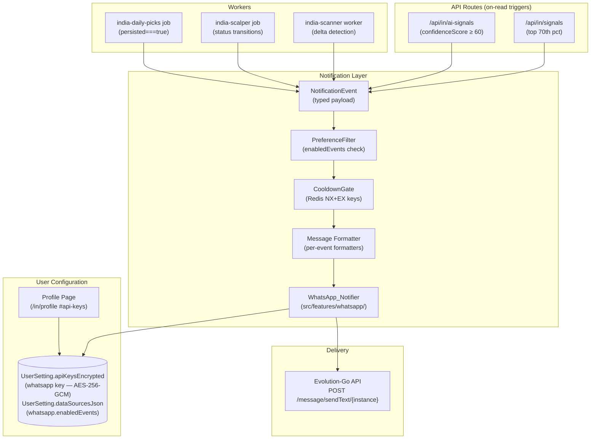

# Design Document: WhatsApp Trading Notifications

## Overview

This feature adds a WhatsApp notification channel to the AlphaForge Indian-market trading platform.
When actionable events occur — Daily Picks freeze, high-confidence AI Signals, Scanner hits, top-percentile Signals Board entries, and Paper Trading position events — the platform dispatches a formatted WhatsApp message to the trader's configured phone number.

Messages are formatted for the Indian market context: ₹ prices with Indian comma notation, NSE/BSE exchange labels, IST timestamps, and lot sizes for index instruments. Delivery is handled by a new `WhatsApp_Notifier` module that calls the Evolution-Go self-hosted gateway (`POST /message/sendText/{instance}`).

The feature is entirely additive — no existing API routes, worker jobs, Prisma schema, or component props change.

---

## Architecture

### High-Level Flow



### Module Placement

The feature is implemented as a new, self-contained module in `src/features/whatsapp/` plus thin integration hooks inside the existing worker jobs and API routes.
No existing module is modified except to call `dispatchWhatsApp(event)` at the trigger points listed below.

```
src/features/whatsapp/
  index.ts           — public barrel: dispatchWhatsApp(), WhatsAppNotifier
  notifier.ts        — HTTP dispatch, retry, cooldown gate
  formatter.ts       — per-event message builders
  preferences.ts     — read/write whatsapp.enabledEvents
  phone.ts           — encrypt/decrypt/validate phone number
  formatters/
    daily-picks.ts
    ai-signal.ts
    scanner.ts
    signals-board.ts
    paper-trade.ts
    shared.ts        — formatINR(), formatIST(), footer()
  types.ts           — NotificationEvent union type

src/components/settings/
  whatsapp-section.tsx   — phone input + event toggles (new component)
  api-keys-form.tsx      — rendered inside existing API keys tab (modified)
  alerts-manager.tsx     — WHATSAPP added to channel chips (modified)

src/features/alerts/
  channels.ts            — WHATSAPP added to DispatchOutcome channel union + ALERT_CHANNELS
  types.ts               — ALERT_CHANNELS updated

src/app/api/in/
  whatsapp/
    status/route.ts      — GET /api/in/whatsapp/status
    test/route.ts        — POST /api/in/whatsapp/test

worker/src/jobs/
  india-daily-picks.ts   — emit DAILY_PICKS_NEW when persisted===true (modified)
  india-scalper.ts       — emit PAPER_TRADE_* on status transitions (modified)

src/lib/env.ts            — WHATSAPP_EVOLUTION_API_URL, WHATSAPP_INSTANCE, WHATSAPP_API_KEY (modified)
worker/src/config.ts      — whatsapp.enabled flag (modified)
.env.example              — commented entries added (modified)
```

---

## Components and Interfaces

### NotificationEvent (types.ts)

```typescript
export type NotificationEventType =
  | "DAILY_PICKS_NEW"
  | "AI_SIGNAL_NEW"
  | "SCANNER_HIT_NEW"
  | "SIGNALS_BOARD_NEW"
  | "PAPER_TRADE_OPENED"
  | "PAPER_TRADE_WIN"
  | "PAPER_TRADE_LOSS"
  | "PAPER_TRADE_EXPIRED";

export interface DailyPicksEvent {
  type: "DAILY_PICKS_NEW";
  pick: DailyPick;           // from features/india/daily-picks/engine.ts
  tradeDate: string;
  bucket: DailyPickBucket;
  generatedAt: number;       // Unix ms
}

export interface AiSignalEvent {
  type: "AI_SIGNAL_NEW";
  signal: AiSignal;          // from types/ai-signals.ts
}

export interface ScannerHitEvent {
  type: "SCANNER_HIT_NEW";
  hit: ScannerHit;           // { symbol, exchange, scannerType, price, changePct, keyMetric }
}

export interface SignalsBoardEvent {
  type: "SIGNALS_BOARD_NEW";
  entry: SignalsBoardEntry;  // { symbol, exchange, sourceType, direction, price, changePct, keyMetric, strengthScore }
}

export interface PaperTradeEvent {
  type: "PAPER_TRADE_OPENED" | "PAPER_TRADE_WIN" | "PAPER_TRADE_LOSS" | "PAPER_TRADE_EXPIRED";
  trade: IndiaPaperTradeSnapshot; // { id, symbol, exchange, direction, source, entry, stopLoss, target, riskReward, openedAt, exitPrice?, pnlPct?, resolvedAt? }
}

export type NotificationEvent =
  | DailyPicksEvent
  | AiSignalEvent
  | ScannerHitEvent
  | SignalsBoardEvent
  | PaperTradeEvent;
```

### WhatsApp_Notifier (notifier.ts)

```typescript
export interface DispatchResult {
  ok: boolean;
  status?: number;
  error?: string;
  suppressed?: boolean;
  suppressReason?: "cooldown" | "no-phone" | "event-disabled" | "not-configured";
}

/**
 * Primary entry point. Reads user preferences, gates on cooldown, formats
 * the message, and calls the Evolution API. Fire-and-forget safe.
 */
export async function dispatchWhatsApp(
  event: NotificationEvent,
  userId: string,
  deps?: { redis?: RedisLike; prisma?: PrismaClient },
): Promise<DispatchResult>;

/**
 * Low-level send — direct HTTP POST to Evolution API.
 * Handles auth header, 8s timeout, single retry on timeout, structured logging.
 */
export async function sendEvolutionMessage(
  phone: string,
  text: string,
): Promise<DispatchResult>;
```

### Message Formatter (formatter.ts)

```typescript
export function formatDailyPicksMessage(event: DailyPicksEvent): string;
export function formatAiSignalMessage(event: AiSignalEvent): string;
export function formatScannerHitMessage(event: ScannerHitEvent): string;
export function formatSignalsBoardMessage(event: SignalsBoardEvent): string;
export function formatPaperTradeMessage(event: PaperTradeEvent): string;
```

### Shared Formatters (formatters/shared.ts)

```typescript
/** Indian number notation: 23450 → "23,450" (index) or 2345.50 → "2,345.50" (stock) */
export function formatINR(price: number, isIndex: boolean): string;

/** Format Unix ms as "DD-Mon-YYYY HH:MM IST" */
export function formatISTDateTime(epochMs: number): string;

/** Format Unix ms as "HH:MM IST" */
export function formatISTTime(epochMs: number): string;

/** Duration between two epoch ms as "Xh Ym" */
export function formatDuration(fromMs: number, toMs: number): string;

/** Standard footer line */
export function messageFooter(): string; // "AlphaForge • NSE F&O • HH:MM IST"

/** Action → header emoji */
export function actionEmoji(action: string): string; // "🟢" | "🔴"

/** Is this symbol a known NSE index? (uses FNO_INDICES catalog) */
export function isIndexSymbol(symbol: string): boolean;

/** Lot size for a known index; undefined otherwise */
export function lotSizeFor(symbol: string): number | undefined;

/** Human-readable scanner type label from catalog */
export function scannerTypeLabel(type: string): string;
```

### Preferences (preferences.ts)

```typescript
export const WHATSAPP_EVENT_TYPES = [
  "DAILY_PICKS_NEW",
  "AI_SIGNAL_NEW",
  "SCANNER_HIT_NEW",
  "SIGNALS_BOARD_NEW",
  "PAPER_TRADE_OPENED",
] as const;
export type WhatsAppEventType = (typeof WHATSAPP_EVENT_TYPES)[number];

export interface WhatsAppPreferences {
  enabledEvents: WhatsAppEventType[];
}

export async function getWhatsAppPreferences(
  userId: string,
  prisma?: PrismaClient,
): Promise<WhatsAppPreferences>;

export async function saveWhatsAppPreferences(
  userId: string,
  prefs: WhatsAppPreferences,
  prisma?: PrismaClient,
): Promise<void>;
```

### Phone Number Helpers (phone.ts)

```typescript
/** E.164 validation: + followed by 7–15 digits */
export const E164_REGEX = /^\+[1-9]\d{6,14}$/;

export function validatePhone(phone: string): { ok: boolean; error?: string };

/** Encrypt phone using the same AES-256-GCM path as API keys */
export function encryptPhone(phone: string): EncryptedPayload;

/** Masked display: "+91 98765 •••••" */
export function maskPhone(phone: string): string;

/** Read (and decrypt) the stored phone for a user; null if not set */
export async function readPhone(userId: string): Promise<string | null>;

/** Persist (encrypted) phone to UserSetting.apiKeysEncrypted["whatsapp"] */
export async function savePhone(userId: string, phone: string): Promise<void>;

/** Remove the whatsapp entry from UserSetting.apiKeysEncrypted */
export async function deletePhone(userId: string): Promise<void>;
```

### Cooldown Gate (inside notifier.ts)

Redis key schema:
```
whatsapp:cooldown:daily-picks:{tradeDate}:{bucket}   TTL 23h
whatsapp:cooldown:ai-signal:{symbol}                  TTL 1800s (30 min)
whatsapp:cooldown:scanner:{type}:{symbol}             TTL 900s  (15 min)
whatsapp:cooldown:signals-board:{symbol}              TTL 1200s (20 min)
whatsapp:cooldown:paper-trade:{symbol}                TTL 60s
```

All keys use Redis `SET NX EX` (atomic set-if-not-exists with expiry) to prevent races across concurrent worker processes.

### API Routes

**GET /api/in/whatsapp/status**
```typescript
// Response
{
  reachable: boolean;       // Evolution API connectivity
  instance: string | null;  // WHATSAPP_INSTANCE or null
  lastDispatchAt: string | null; // ISO timestamp from Redis
  configured: boolean;      // both URL and instance are set
}
```

**POST /api/in/whatsapp/test**
```typescript
// Body: { userId: string }
// Response
{
  ok: boolean;
  message?: string;   // "Test message delivered" or error description
}
```

### UI Component: WhatsAppSection (whatsapp-section.tsx)

A new client component rendered inside `ApiKeysForm` within the API Keys tab on `/in/profile`. Sections:

1. **Configuration Banner** — shown when `WHATSAPP_EVOLUTION_API_URL` is not set; links to Evolution-Go GitHub.
2. **Phone Number Form** — E.164 input, save action, remove action, masked preview when stored.
3. **WhatsApp Alerts Toggles** — five toggle switches for the five event types.
4. **Send Test Message** — button calling `POST /api/in/whatsapp/test`, toast feedback.

---

## Data Models

### UserSetting Extensions (no schema migration required)

The feature piggybacks on two existing JSON columns in `UserSetting`:

**`apiKeysEncrypted` (existing column)** — new key `"whatsapp"`:
```typescript
// Stored as EncryptedPayload (same shape as exchange keys)
apiKeysEncrypted: {
  // ... existing exchange keys ...
  whatsapp: {
    iv: string;   // 24 hex chars
    tag: string;  // 32 hex chars
    ct: string;   // hex ciphertext of the E.164 phone number
    ts: string;   // ISO timestamp
  }
}
```

**`dataSourcesJson` (existing column)** — new nested key `whatsapp`:
```typescript
dataSourcesJson: {
  // ... existing data source settings ...
  whatsapp: {
    enabledEvents: WhatsAppEventType[];  // e.g. ["DAILY_PICKS_NEW", "AI_SIGNAL_NEW"]
  }
}
```

No Prisma migration is required because both columns are `Json?` type — the new keys are written by the application layer.

### Redis Keys

| Key Pattern | TTL | Purpose |
|---|---|---|
| `whatsapp:cooldown:daily-picks:{tradeDate}:{bucket}` | 23h | Deduplicate per-bucket Daily Pick notifications |
| `whatsapp:cooldown:ai-signal:{symbol}` | 1800s | Deduplicate AI signal notifications per symbol |
| `whatsapp:cooldown:scanner:{type}:{symbol}` | 900s | Deduplicate scanner hit notifications |
| `whatsapp:cooldown:signals-board:{symbol}` | 1200s | Deduplicate Signals Board notifications |
| `whatsapp:cooldown:paper-trade:{symbol}` | 60s | Batch paper trade events |
| `whatsapp:last-dispatch` | none | Last successful dispatch ISO timestamp (for status API) |

### Evolution API Request Shape

```typescript
// POST {WHATSAPP_EVOLUTION_API_URL}/message/sendText/{WHATSAPP_INSTANCE}
// Headers: { "Content-Type": "application/json", "apikey": WHATSAPP_API_KEY (if set) }
{
  number: string;    // E.164, e.g. "919876543210" (without leading +)
  text: string;      // formatted message body
}
```

---

## Correctness Properties

*A property is a characteristic or behavior that should hold true across all valid executions of a system — essentially, a formal statement about what the system should do. Properties serve as the bridge between human-readable specifications and machine-verifiable correctness guarantees.*

### Property 1: Non-2xx Evolution API response → failed outcome, no throw

*For any* HTTP response status code outside the 2xx range (400, 401, 403, 404, 429, 500, 503, …), the notifier should return a `DispatchResult` with `ok: false` and the HTTP status code recorded, without throwing an exception.

**Validates: Requirements 1.4**

---

### Property 2: E.164 validation rejects any non-conforming phone string

*For any* string that does not match the pattern `+` followed by 7–15 digits (i.e. does not satisfy `/^\+[1-9]\d{6,14}$/`), the phone validator should return `{ ok: false, error: string }` and never accept the input as valid.

**Validates: Requirements 2.7**

---

### Property 3: Disabled event types are always suppressed

*For any* notification event type `T` that is not in the user's `enabledEvents` array, the notifier should return a result with `suppressed: true` and `suppressReason: "event-disabled"`, regardless of the content of the event payload.

**Validates: Requirements 3.3**

---

### Property 4: Daily Picks message contains all required fields

*For any* valid `DailyPicksEvent` (any bucket, any symbol, any price range), the `formatDailyPicksMessage` function should return a string containing all of: the bucket name, rank, symbol, exchange label, action, entry price prefixed with `₹`, stop-loss prefixed with `₹`, target prefixed with `₹`, confidence score, grade, logic string, and an IST timestamp matching the pattern `DD-Mon-YYYY HH:MM IST`.

**Validates: Requirements 4.2, 4.5, 9.3**

---

### Property 5: Indian currency formatter produces correct notation

*For any* non-negative number `n` and `isIndex` boolean, `formatINR(n, isIndex)` should produce a string starting with `₹`, containing commas in Indian grouping (rightmost group of 3, then groups of 2), and ending with `.XX` decimal digits if and only if `isIndex` is false. For example: `formatINR(23450, true)` → `"₹23,450"`, `formatINR(2345.5, false)` → `"₹2,345.50"`.

**Validates: Requirements 4.3, 9.1, 9.2**

---

### Property 6: IST timestamp formatter round-trips correctly

*For any* valid Unix epoch timestamp (within a 10-year window from 2024 to 2034), `formatISTDateTime(epochMs)` should produce a string matching the pattern `DD-Mon-YYYY HH:MM IST` where the time component is exactly 5 hours 30 minutes ahead of the UTC wall clock time encoded in `epochMs`.

**Validates: Requirements 4.5, 9.4**

---

### Property 7: Cooldown gate suppresses all duplicate dispatches within TTL

*For any* valid cooldown key (tradeDate+bucket, symbol, type+symbol), after the first dispatch sets the Redis key with `SET NX EX`, any subsequent call to `dispatchWhatsApp` for the same key within the TTL window should return `suppressed: true`. This property holds regardless of message content or payload variation.

**Validates: Requirements 4.6, 5.4, 6.3, 7.3, 8.9**

---

### Property 8: AI Signal message contains all required fields

*For any* valid `AiSignalEvent` with `action !== "WAIT"` and `confidenceScore >= 60`, the `formatAiSignalMessage` function should return a string containing all of: symbol, action, confidence (0-100), grade letter, entry price `₹`, stop-loss price `₹`, TP1/TP2/TP3 prices `₹`, risk:reward ratio, win probability `%`, horizon, and at least the first 3 rationale bullets.

**Validates: Requirements 5.2**

---

### Property 9: Action emoji maps correctly for all valid action values

*For any* action string in `{ "LONG", "BUY" }`, `actionEmoji(action)` should return `"🟢"`. *For any* action string in `{ "SHORT", "SELL" }`, `actionEmoji(action)` should return `"🔴"`. This property holds for both AI signal messages and paper trade WIN/LOSS messages.

**Validates: Requirements 5.5, 8.8**

---

### Property 10: Scanner delta detection is correct

*For any* pair (previousHits: Set<string>, currentHits: Set<string>), the scanner delta function should emit a `SCANNER_HIT_NEW` event for exactly every symbol in `currentHits` that is not in `previousHits` — no more, no less. Symbols present in both sets, or only in `previousHits`, should never trigger events.

**Validates: Requirements 6.1**

---

### Property 11: Scanner type labels are human-readable

*For any* scanner type string in the catalog (`"range-expansion"`, `"momentum"`, `"volume-breakout"`, `"oi-buildup"`, `"pcr"`, `"iv-spike"`), `scannerTypeLabel(type)` should return a non-empty string that is distinct from the input type string (i.e. is not the raw snake-case/hyphen-case identifier).

**Validates: Requirements 6.4**

---

### Property 12: Top-70th-percentile gate admits correct entries

*For any* non-empty list of signal strength scores, only signals whose score is strictly greater than the 70th percentile value of that list should trigger a `SIGNALS_BOARD_NEW` event. Signals at or below the 70th percentile should not trigger events.

**Validates: Requirements 7.1**

---

### Property 13: Paper Trade OPENED message contains all required fields

*For any* valid `PaperTradeEvent` with type `"PAPER_TRADE_OPENED"`, the `formatPaperTradeMessage` function should return a string containing all of: symbol, exchange, direction, strategy name, entry price `₹`, stop-loss price `₹`, target price `₹`, risk:reward ratio, and `openedAt` in IST format.

**Validates: Requirements 8.5**

---

### Property 14: Paper Trade WIN/LOSS message contains all required fields

*For any* valid `PaperTradeEvent` with type `"PAPER_TRADE_WIN"` or `"PAPER_TRADE_LOSS"`, the `formatPaperTradeMessage` function should return a string containing all of: symbol, exit price `₹`, a signed P&L percentage (prefixed with `+` for WIN, `-` for LOSS), and a duration string matching the pattern `Xh Ym`.

**Validates: Requirements 8.6**

---

### Property 15: Every formatted message contains the standard footer

*For any* call to any of the five message formatter functions with valid input, the returned string should contain the footer line matching the pattern `AlphaForge • NSE F&O • HH:MM IST`.

**Validates: Requirements 9.5**

---

## Error Handling

### Dispatch Failure Hierarchy

All error paths are non-throwing by design. The notifier follows the same contract as the existing `dispatchWebhook` and `dispatchEmail` functions in `channels.ts`:

| Error Condition | Action |
|---|---|
| `WHATSAPP_EVOLUTION_API_URL` not set | `log.warn`, return `{ ok: false, suppressed: true, suppressReason: "not-configured" }` |
| `WHATSAPP_INSTANCE` not set | `log.warn`, return `{ ok: false, suppressed: true, suppressReason: "not-configured" }` |
| User phone not configured | `log.debug`, return `{ ok: false, suppressed: true, suppressReason: "no-phone" }` |
| Event type disabled by user | `log.debug`, return `{ ok: false, suppressed: true, suppressReason: "event-disabled" }` |
| Cooldown key active (Redis) | no log, return `{ ok: false, suppressed: true, suppressReason: "cooldown" }` |
| Non-2xx HTTP response | `log.warn` (status + body), return `{ ok: false, status }` |
| Network timeout (8s) | abort, `log.warn`, retry once after 2s; if retry also fails, return `{ ok: false, error }` |
| Redis unavailable (cooldown check) | bypass cooldown (best-effort), proceed with dispatch — no crash |
| Prisma unavailable (phone read) | `log.warn`, return `{ ok: false, suppressed: true, suppressReason: "no-phone" }` |
| Sentry DSN set | `captureException` on every non-2xx + network error |

### Fire-and-Forget Integration

All call sites in worker jobs invoke `dispatchWhatsApp` as:

```typescript
void dispatchWhatsApp(event, userId, { redis, prisma }).catch((err) =>
  log.warn("whatsapp dispatch error", { err: err.message }),
);
```

The `void` keyword plus `.catch` ensures the worker tick never awaits or propagates WhatsApp errors. The trading engine continues regardless of notification status.

### Scanner Batch Flooding Guard

When more than 5 new hits are detected in a single scanner tick, the formatters consolidate them into a single summary message instead of fanning out individually:

```
📊 Scanner Alert — Range Expansion
5 new hits: RELIANCE, HDFCBANK, TCS, ICICIBANK, WIPRO
NSE • 10:32 IST

AlphaForge • NSE F&O • 10:32 IST
```

### Paper Trade Batch Guard

When more than 3 paper trade events occur within 60 seconds for the same symbol (detected via the Redis cooldown key existence), subsequent events are queued locally and emitted as a single summary once the TTL expires.

---

## Testing Strategy

### Unit Tests (tests/features/whatsapp/)

Tests for pure formatter functions and validation helpers:

- `phone-validator.test.ts` — Property 2: E.164 validation against generated strings (Hypothesis-style via fast-check)
- `format-inr.test.ts` — Property 5: Indian currency formatter for index and equity prices
- `format-ist.test.ts` — Property 6: IST timestamp formatting with fixed epoch examples
- `action-emoji.test.ts` — Property 9: emoji mapping for all valid action values
- `scanner-label.test.ts` — Property 11: scanner type label non-identity check for all catalog entries
- `format-daily-picks.test.ts` — Property 4, 15: field completeness + footer presence
- `format-ai-signal.test.ts` — Property 8, 15: field completeness + footer presence
- `format-scanner.test.ts` — Property 15: footer presence + batch message path
- `format-signals-board.test.ts` — Property 12, 15: percentile gate + footer
- `format-paper-trade.test.ts` — Property 13, 14, 15: field completeness for each trade status

### Unit Tests (tests/features/whatsapp/notifier/)

- `notifier-dispatch-failure.test.ts` — Property 1: non-2xx responses return `ok:false` without throw
- `notifier-env-guards.test.ts` — Requirements 1.2, 1.3: missing URL/instance skip dispatch
- `notifier-cooldown.test.ts` — Property 7: Redis NX gate suppresses duplicates
- `notifier-preference-filter.test.ts` — Property 3: disabled event types are suppressed

### Integration Tests (tests/api/in/whatsapp/)

- `status.test.ts` — Route returns `reachable`, `instance`, `configured` fields
- `test.test.ts` — Route sends a real-format test message (with mocked fetch)

### Component Tests (tests/components/settings/whatsapp-section/)

- `whatsapp-section.test.ts` — renders phone input, five toggles, test button; shows config banner when URL missing; shows masked preview when phone stored; inline E.164 validation error on bad input

### Property-Based Testing

The project uses Vitest with `fast-check` for property-based tests.
Install: `npm install --save-dev fast-check` (pinned to exact version).

Each property test runs a minimum of 100 iterations:

```typescript
// Example — Property 5
import fc from "fast-check";
import { formatINR } from "@/features/whatsapp/formatters/shared";

it("Property 5: Indian currency formatter", () => {
  fc.assert(
    fc.property(
      fc.float({ min: 0, max: 1_000_000 }),
      fc.boolean(),
      (price, isIndex) => {
        const result = formatINR(price, isIndex);
        expect(result).toMatch(/^₹/);
        if (!isIndex) expect(result).toMatch(/\.\d{2}$/);
        // Indian comma grouping check
        const digits = result.replace(/[₹,\.]/g, "");
        expect(digits).toBe(Math.floor(isIndex ? price : price).toString().replace(".", ""));
      },
    ),
    { numRuns: 100 },
  );
});
// Feature: whatsapp-trading-notifications, Property 5: Indian currency formatter produces correct notation
```

Property tests reference the design document property by tag comment:
```
// Feature: whatsapp-trading-notifications, Property N: {property_text}
```

### Testing Boundaries

- **No real network calls** — all Evolution API calls are mocked with `vi.stubGlobal("fetch", ...)` or `vi.spyOn`
- **No real Redis** — Redis calls use the existing `InMemoryRedis` test adapter from `src/lib/redis.ts`
- **No real Prisma** — DB calls use `vi.mock("@/lib/prisma")` with inline mocks matching the `UserSetting` shape
- **Encryption in tests** — `ENCRYPTION_KEY` set to a fixed 64-hex test value in `tests/setup/vitest.setup.ts`
