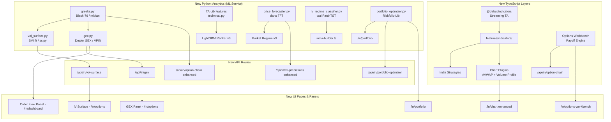

# Alphaforge — Phase 2: Expert Quant Level Upgrade for Indian Markets

## Problem Statement

Alphaforge already has a production-grade NSE F&O signal engine, a Python ML microservice, SmartAPI integration, and 9 trading strategies. To cross the threshold from "advanced retail" to "expert quant / prop desk" level, it needs five layers that are currently absent or shallow:

1. Institutional-grade derivatives analytics (Dealer GEX, IV surface, greeks surface)
2. A chart intelligence layer (anchored VWAP, volume profile at price, footprint)
3. A deep-learning time-series upgrade on the ML service
4. A streaming indicator library that replaces the current hand-rolled helpers
5. An options strategy workbench (payoff diagrams, P&L scenarios, multi-leg builder)

All of this must integrate within the existing Next.js + Python FastAPI architecture, respect TDD, and degrade gracefully when optional data sources are unavailable.

---

## Requirements

- No constraint on tech stack, cost, or data sources — best possible quality
- All enhancements must follow existing TDD policy (failing tests first)
- Must be additive — no breaking changes to existing routes, stores, or worker jobs
- Python ML service enhancements land in `ml-service/src/`, TypeScript enhancements land in `src/`
- NSE-specific calibration throughout (lot sizes, tick sizes, IST time gates, weekly/monthly expiry awareness)

---

## Background & Library Research

### Layer A — Streaming Technical Indicators (TypeScript/Node)

| Library | Why it fits | Where used |
|---|---|---|
| `@debut/indicators` (GPL-3, npm) | Streaming `.nextValue()` + `.momentValue()` per bar, zero recomputation. 50+ indicators cross-validated against lightweight-charts-indicators. Includes Volume Profile with POC/VAH/VAL, Anchored VWAP-compatible primitives, Supertrend, Ichimoku, ADX, ATR, Donchian. State save/restore for Redis serialisation. 3–10× faster than `technicalindicators`. | Replaces hand-rolled helpers in `helpers.ts`; powers chart overlays; feeds indicator values into the ML feature vector |
| `lightweight-charts` v5 plugin API (already installed) | v5 ships a full plugin system. Custom plugins for Volume Profile, Anchored VWAP, and Delta footprint can be rendered directly on the existing price chart with zero new dependencies. | `price-chart.tsx` + new chart plugins |

### Layer B — Options / Derivatives Analytics (Python, ML service)

| Library | Why it fits | Where used |
|---|---|---|
| `py_vollib` / `mibian` (MIT/BSD, pip) | Fast, vectorised Black-Scholes + Black-76 pricing for NSE index options. Computes full greeks (delta, gamma, theta, vega, rho) and solves IV from market LTP in < 1 ms per strike. NSE uses European-style index options so Black-76 is the correct model. `mibian` is pure Python with zero C deps — easier Docker build. | `derivatives.py` (replace synthetic greeks with real ones computed from Angel/NSE chain LTPs) |
| `QuantLib-Python` (BSD, pip) | Full SVI vol surface calibration, term structure, variance swap pricing, local vol model. Overkill for daily signals but essential for the IV surface visualisation endpoint. | New `vol_surface.py` module |
| `scipy.optimize` (already available via scipy in requirements) | Newton-Raphson IV solver as a lightweight fallback when QuantLib is not installed. Pure Python, always available. | Fallback path in `derivatives.py` |

### Layer C — Deep Learning Time-Series (Python, ML service)

| Library | Why it fits | Where used |
|---|---|---|
| `darts` (Apache 2, pip) | Unified API over ARIMA, N-BEATS, TFT (Temporal Fusion Transformer), TCN, LightGBM. Same `fit()`/`predict()` interface. Supports probabilistic forecasting (returns quantile intervals, not just point estimates). NSE intraday 5m candles → OHLCV-multivariate TFT for 1-hour price regime forecast. | New `price_forecaster.py` |
| `tsai` (Apache 2, pip) | PatchTST and LSTM-FCN purpose-built for OHLCV classification. IV percentile classification (will IV crush or spike in next session?). | New `iv_regime_classifier.py` |
| `ta-lib` (BSD C library + pip wrapper) | 150+ indicators computed in vectorised C, used as feature engineering input to all ML models (replaces the existing pure-Python indicator loops in `technical.py` which are too slow for 1000-stock batch scoring). | `technical.py` — swap slow loop for TA-Lib batch calls |

### Layer D — Gamma Exposure & Microstructure (Python, ML service + TypeScript API)

| Library | Approach | Where used |
|---|---|---|
| Self-implemented GEX engine (pure Python, no external dep) | Dealer GEX = Σ (gamma × OI × contract multiplier × spot²) × sign(delta). NSE lot sizes per symbol (NIFTY=50, BANKNIFTY=15, etc.) are known. Angel One chain provides gamma per strike directly. Per-strike and aggregate GEX, gamma flip level, zero-gamma point, and expected daily move band. | `gex.py` + new `/api/in/gex` Next.js route |
| VPIN (Volume-classified order flow) — from academic reference implementation | Classify 5-min bar volume into buy/sell volume using tick-rule (close vs prior close). VPIN = \|buy_vol − sell_vol\| / bucket_size | `volume.py` + new `/api/in/order-flow` route |

### Layer E — Backtesting & Portfolio Analytics (Python, ML service)

| Library | Why it fits | Where used |
|---|---|---|
| `backtesting.py` (AGPL, pip) | Vectorised Python backtester with built-in optimizer and interactive Bokeh plots. Designed for OHLCV candles. Can wrap any of Alphaforge's existing strategy logic. Used to produce walk-forward validation stats for the India strategy backtest page. | `india_backtest.py` |
| `Riskfolio-Lib` (BSD, pip) | Production-grade portfolio optimizer: HRP (already used), CVaR, CDaR, risk budgeting, factor models. Upgrades the existing PyPortfolioOpt HRP to include drawdown-aware allocation and factor tilts. | `portfolio_optimizer.py` |

### Layer F — NSE Data Enrichment (Python + TypeScript)

| Library | Why it fits | Where used |
|---|---|---|
| `yfinance` (Apache 2, pip — already used via `yahoo-finance2` on Node side) | Python-native Yahoo Finance for the ML training pipeline. Fetches 5+ years of NSE OHLCV for 200+ F&O names in a single batch call. Used in `data_pipeline.py` to feed TFT / PatchTST training. | `data_pipeline.py` |
| OpenAlgo broker REST patterns (MIT) | OpenAlgo's normalised `/api/v1/` contract covers 33 Indian brokers including Zerodha/Kite. Rather than adding OpenAlgo as a dependency, Alphaforge implements the same normalised contract shape in its own broker adapter layer — enabling users to point any OpenAlgo-compatible broker at the dashboard via a single env var. | `src/services/india/broker/` — extend `MarketBroker` contract with an `OpenAlgoAdapter` |

---

## Proposed Solution

Add six self-contained enhancement phases that each produce a standalone, demo-able increment. Each phase has its own feature branch, TDD coverage, and zero impact on existing paths when the new capability is absent (all new endpoints degrade gracefully with a `{ available: false }` sentinel).

---

## Dependency Summary

### npm (TypeScript/Node)

```
@debut/indicators   # streaming indicator library
recharts            # already "planned" in stack — now wired in
```

### pip (Python ML service)

```
mibian==0.1.3           # Black-Scholes/Black-76 greeks
darts==0.32.*           # TFT, N-BEATS forecasting
tsai==1.0.*             # PatchTST IV classifier
TA-Lib==0.6.*           # vectorised C indicators
Riskfolio-Lib==6.*      # HRP + CVaR portfolio optimizer
```

---

## Architecture Diagram



---

## Task Breakdown

---

### Task 1: Replace hand-rolled indicator helpers with @debut/indicators

**Objective:** Swap the ad-hoc EMA/SMA/RSI/ATR/Bollinger implementations in `helpers.ts` and `src/features/india/scalping/` with `@debut/indicators` streaming classes. Add Volume Profile (POC/VAH/VAL) and Supertrend as new outputs.

**Implementation guidance:**

- `npm install @debut/indicators` (pinned exact version)
- Create `src/features/indicators/` with a thin adapter layer (`streamIndicators(bars, config) → IndicatorOutput`) that wraps `@debut/indicators` classes and exposes the same interface the existing strategies expect. This isolates the dependency.
- Migrate `helpers.ts` one function at a time: EMA → `new EMA(n)`, ATR → `new ATR(n)` (Wilder's SMMA), RSI → `new RSI(14)`, Bollinger → `new BollingerBands(20, 2)`.
- Add `VolumeProfile` with `tickSize` calibrated to NSE (0.05 for stocks, 1 for NIFTY, 5 for BANKNIFTY) and expose POC/VAH/VAL per session.
- Add `SuperTrend` (period=10, multiplier=3) as a new indicator output.
- Use `.dumpState()` / `.restoreState()` to persist indicator state in Redis so the worker resumes warmup on restart.

**Test requirements:**

- `tests/features/indicators/` — unit tests for each migrated indicator against known OHLCV fixtures. ATR output must match the existing Wilder's ATR to within 0.01%.
- `volume-profile.test.ts` — verify POC is the price row with highest volume.
- All existing strategy tests (`tests/features/`) must remain green.

**Demo:** On `/in/chart/[symbol]`, the price chart shows a Volume Profile bar chart on the right axis (POC = orange, VAH/VAL = dashed), and the signal engine now outputs supertrend direction alongside the existing indicators. Warm start after worker restart completes in < 5 bars.

---

### Task 2: Lightweight-charts v5 chart plugins — Anchored VWAP + Volume Profile overlay

**Objective:** Add two institutional chart tools that every NSE desk uses: (a) multi-anchor VWAP (session open, daily open, weekly open — all three simultaneously) and (b) Volume Profile histogram rendered as a horizontal bar series on the price chart.

**Implementation guidance:**

- Read the lightweight-charts v5 plugin API at `node_modules/next/dist/docs/` before writing any plugin code, as instructed.
- Create `anchored-vwap.ts` — a `IChartSeriesPlugin` that subscribes to tick data, accumulates `Σ(typical_price × volume) / Σvolume` from the chosen anchor bar, and renders as a `LineSeries` overlay. Anchors: session open (09:15 IST), daily open, weekly open. Three lines, distinct colors.
- Create `volume-profile.ts` — renders POC/VAH/VAL as horizontal lines and optionally a mini histogram. Uses the `VolumeProfile` output from Task 1.
- Both plugins togglable via a toolbar above the chart.
- `price-chart.tsx` integrates both plugins, passes the `useTheme()` palette.

**Test requirements:**

- `anchored-vwap.test.ts` — test the VWAP accumulation math with synthetic OHLCV data: given 10 bars from session open, VWAP must equal `Σ(HLC3 × vol) / Σvol`.
- `volume-profile.test.ts` — POC is the row with max volume.

**Demo:** Navigate to `/in/chart/NIFTY`. Toggle "VWAP" button — three VWAP lines appear on the chart (session/daily/weekly). Toggle "Profile" — a horizontal Volume Profile histogram appears on the right edge. Both persist on timeframe change.

---

### Task 3: Python — replace synthetic greeks with real BS/Black-76 greeks on the option chain

**Objective:** Replace the estimated/zero greeks currently in the NSE option chain with real Black-Scholes (stocks) and Black-76 (index options) greeks, computed from live chain LTP + India VIX as the vol input. Add the IV smile per expiry and the term structure.

**Implementation guidance:**

- `pip install mibian==0.1.3` (pure Python, no C deps, easy Docker build)
- Create `greeks.py`:
  - `compute_greeks_bs(spot, strike, r, t, sigma, flag) → {delta, gamma, theta, vega, rho, iv}`
  - `solve_iv_newton(market_price, spot, strike, r, t, flag) → float` using Newton-Raphson (fallback to `scipy.optimize.brentq`)
  - `compute_chain_greeks(chain_rows, spot, india_vix, expiry_dt) → vectorised over all strikes`
- Risk-free rate: use Indian 10Y G-Sec yield (hardcode ~7.1% or fetch from RBI endpoint)
- `t = trading days to expiry / 252` (NSE calendar)
- Expose as a new `/analytics/greeks` FastAPI endpoint (batch input: chain snapshot JSON)
- On the TypeScript side, the existing `/api/in/option-chain` route calls this endpoint for enhanced greeks when the ML service is reachable, with a transparent fallback to the existing Angel One delta/gamma fields.

**Test requirements:**

- `test_greeks.py` — test `compute_greeks_bs` against known ATM NIFTY values (delta ≈ 0.50, gamma should be positive, theta negative)
- `option-chain.test.ts` — verify route returns `available: false` in greeks fields when ML service is down (no crash)

**Demo:** On `/in/options`, click "Greeks" toggle. The chain table now shows accurate delta/gamma/theta/vega per strike computed from live LTP. An "IV Smile" tab appears below the chain showing IV plotted against moneyness for the near expiry.

---

### Task 4: Dealer GEX engine — /api/in/gex + GEX Dashboard panel

**Objective:** Compute NSE Dealer Gamma Exposure (GEX) per strike and in aggregate. Render a GEX bar chart by strike, the Gamma Flip level (where dealer hedging flips from stabilising to destabilising), and the expected daily move band from aggregate GEX.

**Implementation guidance:**

- Create `gex.py`:

```python
# GEX formula for NSE:
# Per-strike GEX = gamma × OI × lot_size × spot²  (CE adds, PE subtracts)
# Aggregate GEX = Σ per-strike GEX
# Gamma flip = strike where cumulative GEX crosses zero
# Expected move = spot × sqrt(|aggregate_GEX| / (spot² × total_OI × lot_size))

LOT_SIZES = {"NIFTY": 50, "BANKNIFTY": 15, "FINNIFTY": 40, "MIDCPNIFTY": 75}
```

- Inputs: chain snapshot (from Angel One or NSE proxy) with gamma per strike
- When gamma is not available (non-Angel deployments), approximate from Black-76 via Task 3 greeks engine
- Outputs: `{strikes[], gex_per_strike[], aggregate_gex, gamma_flip, expected_move_pct, positive_gex_wall, negative_gex_wall}`
- Expose at `/analytics/gex` (POST: chain JSON)
- New Next.js route: `GET /api/in/gex?symbol=NIFTY` — calls ML service, caches 5 min in Redis
- New component: `gex-panel.tsx` — GEX bar chart (green = positive / dealer long gamma, red = negative / dealer short gamma), horizontal Gamma Flip line, expected move band shaded on the price axis.

**Test requirements:**

- `test_gex.py` — given synthetic chain data, verify aggregate GEX sign, gamma flip strike, expected move is positive.
- `gex.test.ts` — route returns `{ available: false }` when ML service is down.
- `gex-panel.test.ts` — renders the bar chart, shows gamma flip label.

**Demo:** On `/in/options`, a new "GEX" tab panel shows a bar chart of per-strike GEX for NIFTY. The Gamma Flip level (e.g. 23,400) is highlighted. A subtitle reads "Expected daily move: ±0.7% (±162 pts)". Positive GEX zones (market stabilising) and negative GEX zones (market can trend) are visually distinct.

---

### Task 5: 3D Implied Volatility Surface + IV Term Structure

**Objective:** Build an IV surface visualisation across strikes and expiries — the single most powerful chart for an NSE options trader. Add the vol term structure (ATM IV per expiry) and the vol smile (IV vs strike for each expiry).

**Implementation guidance:**

- Create `vol_surface.py`:
  - `build_iv_surface(snapshots_by_expiry)` — for each expiry, solve IV per strike using Task 3's Newton solver. Returns a dict keyed by expiry date, with arrays of `(strike, iv)`.
  - `fit_svi(strikes, ivs, forward) → SVI params (a, b, ρ, m, σ)` using `scipy.optimize.minimize` — this gives a smooth, arbitrage-free IV surface.
  - `compute_term_structure(atm_ivs_by_expiry) → list of {days_to_expiry, atm_iv}`
- No QuantLib dependency — pure Python + scipy (already in requirements)
- New endpoint: `GET /analytics/vol-surface?symbol=NIFTY` on the ML service
- New Next.js route: `GET /api/in/vol-surface?symbol=NIFTY`
- UI: `vol-surface.tsx` — uses Recharts (already in tech stack, planned) for a 2D multi-line chart (one line per expiry, IV vs strike). Term structure as a separate area chart. A "3D" tab renders the surface using a lightweight WebGL canvas (plain `<canvas>` + simple projection math — no extra library needed).

**Test requirements:**

- `test_vol_surface.py` — verify SVI fit produces no calendar spread arbitrage (ATM IV of near expiry ≤ far expiry after adjustment).
- `vol-surface.test.ts` — renders without crash; shows correct number of expiry lines.

**Demo:** On `/in/options`, a new "IV Surface" tab shows: (1) a 2D "IV Smile" chart with one line per expiry, (2) a "Term Structure" chart showing ATM IV is in contango, (3) a "3D Surface" toggle that renders the full IV surface as a shaded canvas grid. Hovering a point shows `{strike, expiry, IV}`.

---

### Task 6: TA-Lib vectorised feature engineering in the ML service

**Objective:** Replace the slow pure-Python indicator loops in `technical.py` with TA-Lib C-backed vectorised calls. This reduces the batch scoring time for 200+ stocks from ~4 seconds to < 300 ms — making it viable to score the full F&O universe in real time on every tick.

**Implementation guidance:**

- `pip install TA-Lib==0.6.x` (binary wheels available for Python 3.11 on Linux/Mac/Windows)
- Refactor `technical.py` to use `talib.RSI()`, `talib.MACD()`, `talib.ADX()`, `talib.ATR()`, `talib.BBANDS()`, `talib.EMA()`, `talib.STOCHRSI()`, `talib.CCI()`, `talib.MFI()`, `talib.OBV()` — all accept numpy arrays, all run in C.
- Add new indicators now unblocked by the speed gain: `talib.CDLENGULFING()`, `talib.CDLHAMMER()`, `talib.CDLDOJI()` (candlestick pattern features — binary 0/1 per bar), `talib.HT_TRENDLINE()` (Hilbert Transform instantaneous trendline).
- The `RANKING_FEATURES` list in `stock_ranker.py` gets 6 new binary candle-pattern features + HT_TRENDLINE deviation.
- Update Dockerfile to install the TA-Lib C library: `RUN apt-get install -y ta-lib` (already works on Debian slim).

**Test requirements:**

- `test_technical.py` — EMA(20) from TA-Lib must match the existing EMA implementation to within 1e-6 on 1000-bar synthetic series.
- `test_talib_perf.py` — scoring 100 stocks must complete in < 1 second.

**Demo:** Run `python -m src.training.data_pipeline --quick`. Observe the feature engineering step now completes in < 5 seconds for the full F&O universe (previously 40+ seconds). The new candle-pattern features appear in SHAP waterfall plots on `/api/in/ml-predictions`.

---

### Task 7: VPIN (toxic order flow) indicator + order flow panel on the dashboard

**Objective:** Add a VPIN (Volume-synchronized Probability of Informed Trading) indicator to the ML feature set and expose it as a live order flow toxicity gauge on the India Overview dashboard — the same signal used by HFT desks to detect informed trading ahead of big moves.

**Implementation guidance:**

- Extend `volume.py`:

```python
def compute_vpin(bars, bucket_size=50, n_buckets=50):
    # 1. Classify each bar volume as buy/sell using tick rule
    # 2. Accumulate into fixed-size volume buckets
    # 3. VPIN(t) = mean(|BuyVol - SellVol| / BucketSize) over last n_buckets
    # Returns: rolling VPIN series + current value [0,1]
```

- VPIN > 0.7 = toxic (informed flow, expect large move)
- VPIN < 0.3 = benign (noise traders, range-bound expected)
- Wire into Market Regime model: `vpin_score` becomes a new regime input feature replacing the unused `breadth_ratio` slot.
- New TypeScript component: `order-flow-panel.tsx` — a horizontal gauge bar (red = toxic, green = benign) with a sparkline of VPIN over the last 20 buckets. Shows per-index (NIFTY/BANKNIFTY).
- Placed on the India Overview dashboard between the Range Expansion section and Top 5 Stocks.
- New Next.js route: `GET /api/in/order-flow?symbol=NIFTY` — fetches from ML service, 2-min Redis cache.

**Test requirements:**

- `test_vpin.py` — given all buys, VPIN = 0. Given alternating buy/sell, VPIN ≈ 0. Given all buys in one half, VPIN ≈ 1.
- `order-flow-panel.test.ts` — renders gauge + sparkline; shows "Toxic" label when VPIN > 0.7.

**Demo:** On `/in/dashboard`, the new "Order Flow" panel shows a VPIN gauge for NIFTY. On a day with large institutional activity (e.g. expiry morning), VPIN spikes toward red and the panel shows "High Informed Flow Detected". The gauge value feeds into the ML regime blending weight for the AI Signals engine.

---

### Task 8: Deep-learning price regime forecaster (Temporal Fusion Transformer via darts)

**Objective:** Add a TFT (Temporal Fusion Transformer) model to the ML service that forecasts the 1-hour ahead NIFTY/BANKNIFTY price regime (up > 0.3% / flat / down > 0.3%) with quantile uncertainty bounds. This upgrades the heuristic nifty-bias estimate to a proper probabilistic forecast.

**Implementation guidance:**

- `pip install darts==0.32.*` (pinned)
- Create `price_forecaster.py`:
  - Input: multivariate time series — OHLCV + VPIN + ATM IV + PCR + OI build-up (last 60 × 5-min bars = 5 hours history)
  - Model: `darts.models.TFTModel` with `input_chunk_length=60`, `output_chunk_length=12` (next 1 hour at 5-min resolution), `hidden_size=64`, `num_heads=4`
  - Output: `{regime: "bull"|"bear"|"flat", probability: float, q10: float, q90: float}` — the q10/q90 form the expected move band
  - Training: `data_pipeline.py` fetches 2 years of 5-min NIFTY bars via yfinance Python client and saves to `nifty_5m.npz`
- Expose at `/predict/price-regime` (POST: last 60 bars OHLCV)
- Blend into `india-builder.ts`: `buildMLContext()` adds a `priceForecast` field alongside `regime` and `rankings`. The AI Signals engine's `sessionQuality` factor receives a ±0.05 confidence delta based on TFT regime alignment.

**Test requirements:**

- `test_price_forecaster.py` — model loads, predicts without error, output shape is correct, probability sums to 1.
- `india-builder.test.ts` — `buildMLContext()` includes `priceForecast`, AI signal confidence changes when TFT disagrees with heuristic direction.

**Demo:** On `/in/ai-signals`, the AI market context banner now shows a new "TFT Forecast" chip: "NIFTY: Bull (67% confidence, +0.4% to +1.1% next hour)". The chip is grey when the ML service is offline. Signals where TFT agrees get a small "ML ✓" tag on the signal card.

---

### Task 9: IV Regime Classifier — IV crush/spike predictor via tsai PatchTST

**Objective:** Add a model that classifies whether NSE ATM IV is likely to crush (contract) or spike in the next session, critical for options sellers (straddle / strangle writers) and buyers (pre-event long vega). Uses PatchTST — the state of the art for multi-patch OHLCV classification.

**Implementation guidance:**

- `pip install tsai==1.0.*` (pinned, Python 3.11 compatible)
- Create `iv_regime_classifier.py`:
  - Input: last 20 days of daily `{atm_iv, pcr, oi_change, vix, spot_change}` — 5 features × 20 days
  - Model: `tsai.models.PatchTST` — `n_layers=3`, `d_model=128`, `n_heads=4`, `patch_len=5`
  - Labels: `CRUSH` (IV drops > 10% next session), `STABLE`, `SPIKE` (IV rises > 15%)
  - Training data: build from `OptionChainSnapshot` table (already captured by `india-oc-capture` worker) + VIX
- Expose at `/predict/iv-regime`
- Wire into the AI Signals India builder: IV factor confidence weight is boosted when `iv_regime == CRUSH` (sellers have edge) or penalised when `SPIKE` is predicted (buyers have edge — counter to the usual ATM IV inversion).
- Surface on the `/in/options` page as an "IV Forecast" badge: "CRUSH expected tomorrow — good for premium sellers."

**Test requirements:**

- `test_iv_classifier.py` — model loads, input shape accepted, output is one of three classes.
- `option-chain.test.ts` — route returns `iv_regime` field (may be null when model untrained).
- `iv-regime-badge.test.ts` — shows "Crush" in green, "Spike" in red.

**Demo:** On `/in/options`, above the chain table, an "IV Outlook" badge reads "CRUSH — IV likely to contract tomorrow (83% confidence)". Options sellers see this as a green light. On AI Signals, BANKNIFTY straddle signal confidence is adjusted by ±0.05 based on the IV forecast direction.

---

### Task 10: Upgrade ML Portfolio Optimizer to Riskfolio-Lib (HRP + CVaR + Factor model)

**Objective:** Replace the existing PyPortfolioOpt HRP in the ML service with Riskfolio-Lib, adding CVaR-constrained allocation, maximum diversification, and a simple factor model (beta to NIFTY + size factor). Expose a `/in/portfolio-optimizer` page for quant-level portfolio construction.

**Implementation guidance:**

- `pip install Riskfolio-Lib==6.*` (replaces PyPortfolioOpt in `requirements.txt` — PyPortfolioOpt kept as fallback)
- Refactor `portfolio_optimizer.py`:
  - `hrp_allocation(returns)` — existing HRP, now via Riskfolio
  - `cvar_allocation(returns, alpha=0.05)` — CVaR-constrained MVO
  - `max_diversification(returns)` — maximum diversification portfolio
  - `factor_allocation(returns, factor_returns)` — with NIFTY beta neutrality constraint
  - All methods return `{weights: {symbol: float}, risk_metrics: {volatility, cvar, sharpe, max_dd}}`
- New page: `src/app/(dashboard)/in/portfolio/page.tsx` — quant portfolio builder:
  - Symbol multi-select from F&O universe
  - Method selector (HRP / CVaR / Max Diversification / Factor)
  - Efficient frontier chart (Recharts scatter plot of risk vs return)
  - Allocation pie chart
  - Risk metrics table

**Test requirements:**

- `test_portfolio_optimizer.py` — weights sum to 1, all weights ≥ 0, CVaR < HRP CVaR for same inputs.
- `portfolio.test.ts` — route accepts symbols + method, returns valid allocation.
- `portfolio.test.ts` — page renders without crash.

**Demo:** Navigate to the new `/in/portfolio` page. Select NIFTY, BANKNIFTY, RELIANCE, HDFCBANK, TCS. Pick "CVaR" method. The efficient frontier appears as a scatter plot. The allocation table shows weights summing to 100%, with NIFTY at ~30%, others diversified. Risk metrics show portfolio Sharpe and Max Drawdown.

---

### Task 11: Options Strategy Workbench — P&L payoff diagrams + multi-leg builder

**Objective:** Add a full options strategy builder with P&L payoff diagrams at expiry (and at any intermediate date). Cover the 12 most-used NSE F&O strategies: Long/Short Call, Long/Short Put, Bull/Bear Call Spread, Iron Condor, Straddle, Strangle, Butterfly, Jade Lizard.

**Implementation guidance:**

- This is a pure TypeScript feature — no new Python dependency.
- Create `src/features/india/options-workbench/`:
  - `strategies.ts` — predefined leg templates for all 12 strategies (strike offsets from ATM, quantity, CE/PE flag)
  - `payoff.ts` — `computePayoff(legs, spot_at_expiry, premiums)` — pure function, returns net P&L array over a spot range
  - `greeks-aggregator.ts` — aggregate delta/gamma/theta/vega across legs (from Task 3 real greeks)
  - `engine.ts` — combine both above into `StrategyAnalysis` type
- New page: `src/app/(dashboard)/in/options-workbench/page.tsx`:
  - Strategy picker (dropdown + custom leg builder)
  - ATM auto-populate from live chain (`/api/in/option-chain`)
  - Payoff diagram: Recharts `LineChart` with P&L on Y axis, underlying price on X axis. Two lines: payoff at expiry + payoff today (using Task 3 BS greeks)
  - Net greeks display (portfolio delta, gamma, theta, vega)
  - Break-even points highlighted
  - "Scan for strategy on chain" — scans the live chain for the best strikes to execute the chosen strategy given current IV and max-pain

**Test requirements:**

- `payoff.test.ts` — Long Call payoff at expiry = `max(0, spot − strike) − premium`. Straddle P&L at ATM = `−2 × premium` (max loss). Iron Condor at centre = net credit received.
- `tests/components/india/options-workbench/` — page renders, payoff chart appears with correct number of data points.

**Demo:** Navigate to `/in/options-workbench`. Select "Iron Condor" on NIFTY. The chain auto-populates the four legs. The payoff diagram shows the characteristic flat-profit zone between the two short strikes, with max loss at the wings. Net greeks show delta ≈ 0 (delta-neutral). "Scan for best strikes" suggests legs that maximise the profit zone relative to the GEX-implied expected move from Task 4.

---

### Task 12: OpenAlgo-compatible broker adapter + live order execution scaffold

**Objective:** Implement an `OpenAlgoAdapter` that speaks the normalised OpenAlgo REST API contract, enabling any of the 33+ OpenAlgo-compatible Indian brokers (Zerodha Kite, Upstox, Fyers, etc.) to connect to Alphaforge via a single `INDIA_BROKER=openalgo` env var + base URL. Also complete the Angel One live order placement scaffold deferred in the roadmap.

**Implementation guidance:**

- Create `openalgo-adapter.ts`:
  - Implements `MarketBroker` contract
  - Endpoints: `GET /api/v1/quotes` → live quotes, `GET /api/v1/historical` → OHLCV, `POST /api/v1/placeorder` → order (behind explicit opt-in flag)
  - Auth: API key in `X-Api-Key` header (stored encrypted in DB, same AES-256-GCM path as Angel keys)
- Complete `portfolio.ts` live order methods:
  - `placeOrder(params)` / `modifyOrder(id, params)` / `cancelOrder(id)` — gated behind `LIVE_TRADING_ENABLED=true` env var
  - Order confirmation modal in the UI before any real order is placed (explicit double-confirm)
- New Profile tab: "Live Trading" — shows broker connection status, account balance, open order book
- Risk guard: every order is checked against the paper trading journal — if the signal has < 50% win rate in paper trades, a warning is surfaced before the live order confirm

**Test requirements:**

- `openalgo-adapter.test.ts` — mock HTTP responses, verify quotes/historical/order shape normalisation.
- `portfolio.test.ts` — `placeOrder` throws if `LIVE_TRADING_ENABLED` is not set.
- All order placement paths require the confirmation modal — tested in `live-order-modal.test.ts`.

**Demo:** Set `INDIA_BROKER=openalgo`, `OPENALGO_BASE_URL=http://localhost:5000`, `OPENALGO_API_KEY=xxx`. Open `/in/paper-trading`. A "Go Live" button appears next to each strategy. Clicking it shows a confirmation modal with the signal details, current paper-trade win rate, and a "Place Real Order" button. The order is sent to OpenAlgo and the response appears in the UI.

---

## Implementation Order & Dependencies

```
Task 1  (indicators)        → no deps
Task 2  (chart plugins)     → depends on Task 1 (VolumeProfile output)
Task 3  (real greeks)       → no deps
Task 4  (GEX engine)        → depends on Task 3 (greeks fallback)
Task 5  (IV surface)        → depends on Task 3 (IV solver)
Task 6  (TA-Lib)            → no deps
Task 7  (VPIN)              → no deps (parallel with Task 6)
Task 8  (TFT forecaster)    → depends on Task 6 (faster feature pipeline) + Task 7 (VPIN feature)
Task 9  (IV classifier)     → depends on Task 3 (IV data)
Task 10 (portfolio)         → no deps (standalone Python refactor)
Task 11 (workbench)         → depends on Task 3 (real greeks), Task 4 (GEX expected move)
Task 12 (broker adapter)    → no deps (standalone adapter layer)
```

**Suggested parallel tracks:**

- Track A: Tasks 1 → 2 (TypeScript indicator + chart)
- Track B: Tasks 3 → 4 → 5 (greeks → GEX → IV surface)
- Track C: Tasks 6 → 7 → 8 (TA-Lib → VPIN → TFT)
- Track D: Tasks 9, 10, 11, 12 (independent, can run after Track B partially done)

---

## NSE-Specific Calibration Notes

| Parameter | NIFTY | BANKNIFTY | FINNIFTY | MIDCPNIFTY | Stocks |
|---|---|---|---|---|---|
| Lot size | 50 | 15 | 40 | 75 | varies |
| Tick size | 1 pt | 5 pt | 1 pt | 1 pt | 0.05 |
| Options style | European | European | European | European | American |
| Pricing model | Black-76 | Black-76 | Black-76 | Black-76 | Black-Scholes |
| Expiry cycle | Weekly (Thu) + Monthly | Weekly (Wed) + Monthly | Weekly (Tue) + Monthly | Monthly | Monthly |
| Session open | 09:15 IST | 09:15 IST | 09:15 IST | 09:15 IST | 09:15 IST |
| Risk-free rate | 10Y G-Sec ~7.1% | same | same | same | same |

---

## Graceful Degradation Contract

Every new endpoint and panel must follow this contract when optional services are unavailable:

```typescript
// API route — ML service down
{ available: false, reason: "ML service unreachable" }

// API route — data not yet computed
{ available: false, reason: "Model not trained" }

// UI component
if (!data?.available) return <UnavailableBadge />
```

No existing route, store, or worker job may throw because a Phase 2 service is absent.
